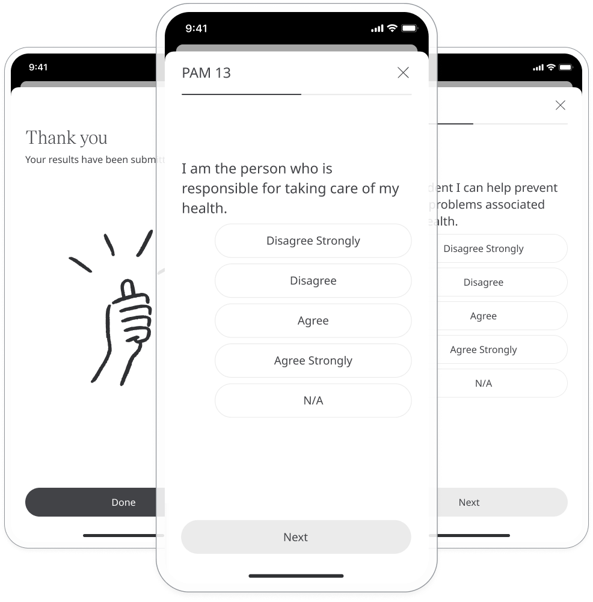
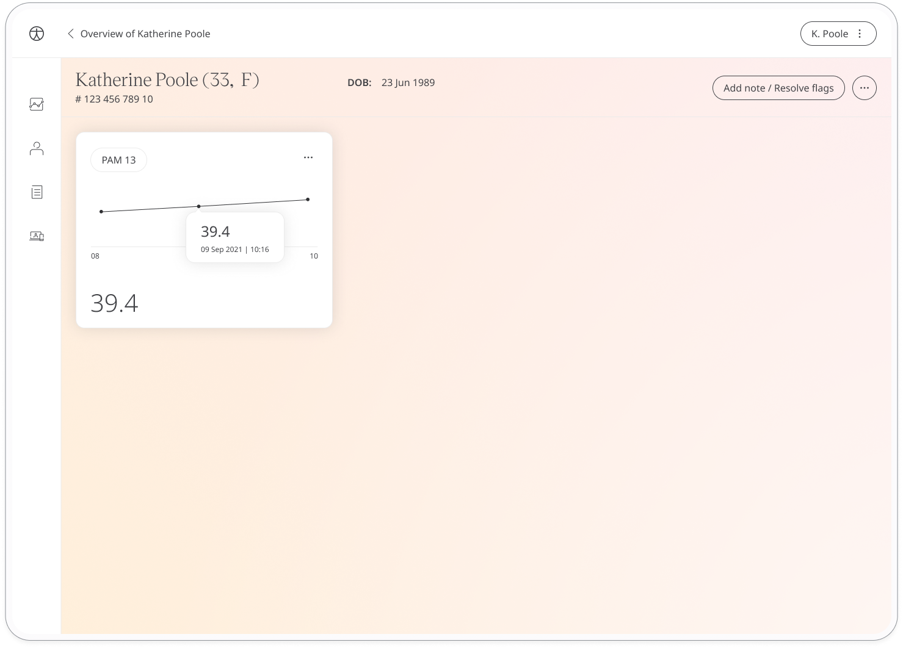

Patient activation looks at how confident a patient is when it comes to managing their health. The patient activation measure (PAM-13) questionnaire is an easy way for patients to provide this information to their care team, who can use this data to understand how to best help and support them.

## How it works

Patients answer generic questions about how they feel about their health. To start, patients select the Patient Activation Measure-13 module and click **Add**. When they have answered all the questions, they will be assigned a score that is shared with their care team. From within the module, patients can view their progress in a graph and also access all their previous results. Daily, weekly, or monthly reminders can be set to help stay on track.

## Clinicians

In the Huma Portal, care teams will see the latest Patient Activation Measure-13 score for their patient, with concerning scores flagged for attention.

In the Patient Summary, care teams can view all historical data in graph or table form..

