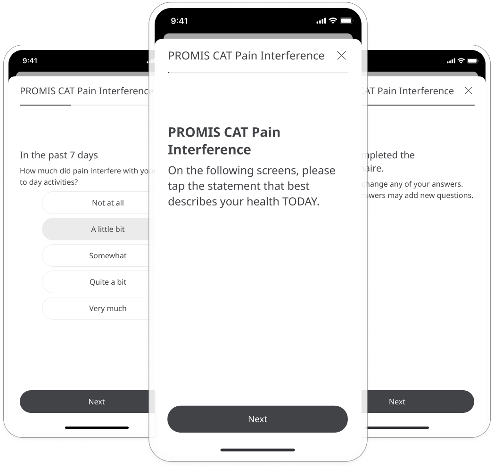

The PROMIS CAT Pain Interference Questionnaire quantifies a patient's self-reported pain and its effect on their lives. Responses are shared with care teams to gather insight to provide appropriate and timely healthcare.

## How it works

Patients respond to questions that ask how often or how severely pain interferes with daily activities. They answer from a set of multiple choice options that measure how strongly they agree with each statement. The assessment uses computerised adaptive testing (CAT), which means the questions adapt to the user's ability level. 

To start, patients select the PROMIS CAT Pain Interference module and click **Add**. When they have answered all the questions, they will be assigned a score that is shared with their care team. From within the module, patients can view their progress in a graph and also access all their previous results. Daily, weekly, or monthly reminders can be set to help stay on track.  

In the Care Portal, care teams will see the latest PROMIS CAT Pain Interference score for their patient, with concerning scores flagged for attention. 

In the Patient Summary, care teams can view all historical data in graph or table form.

