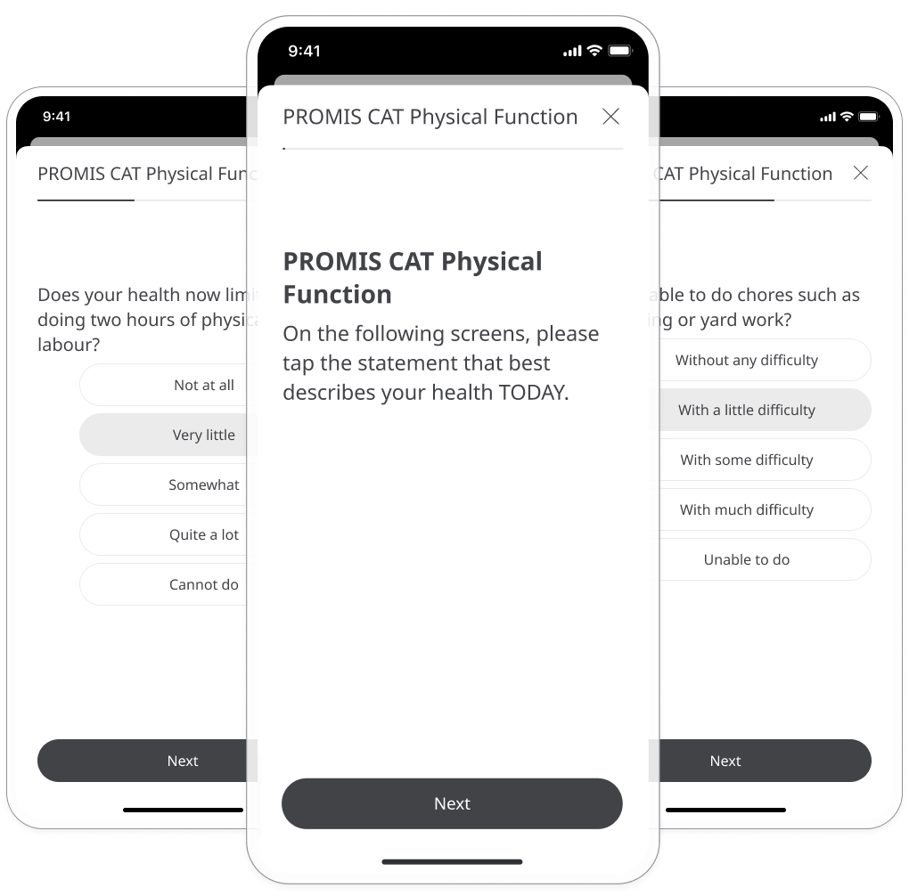
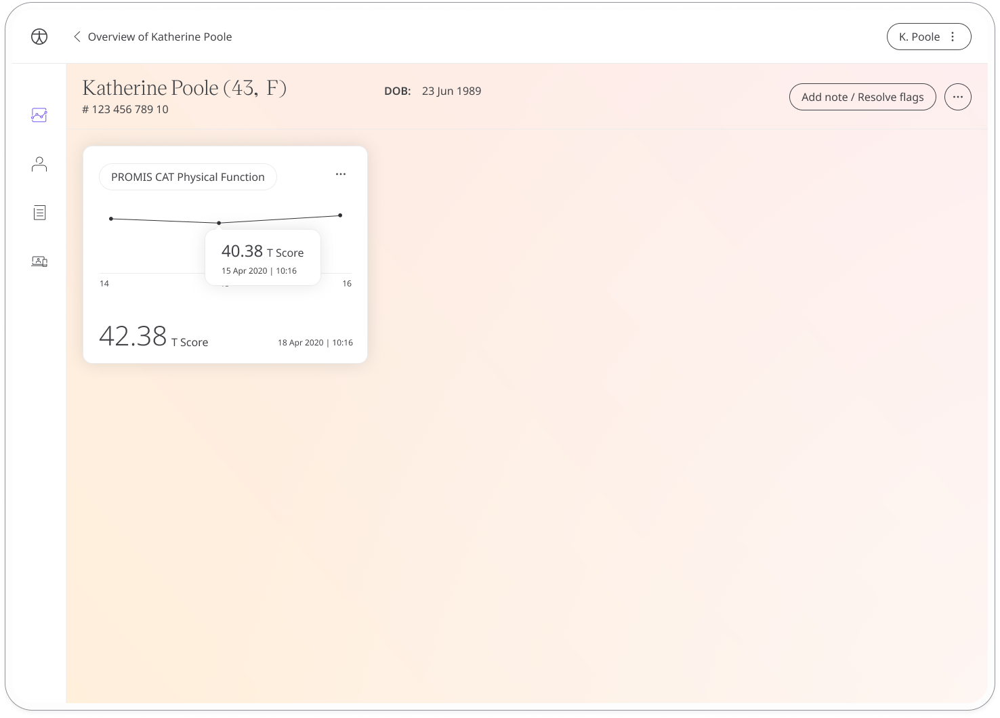
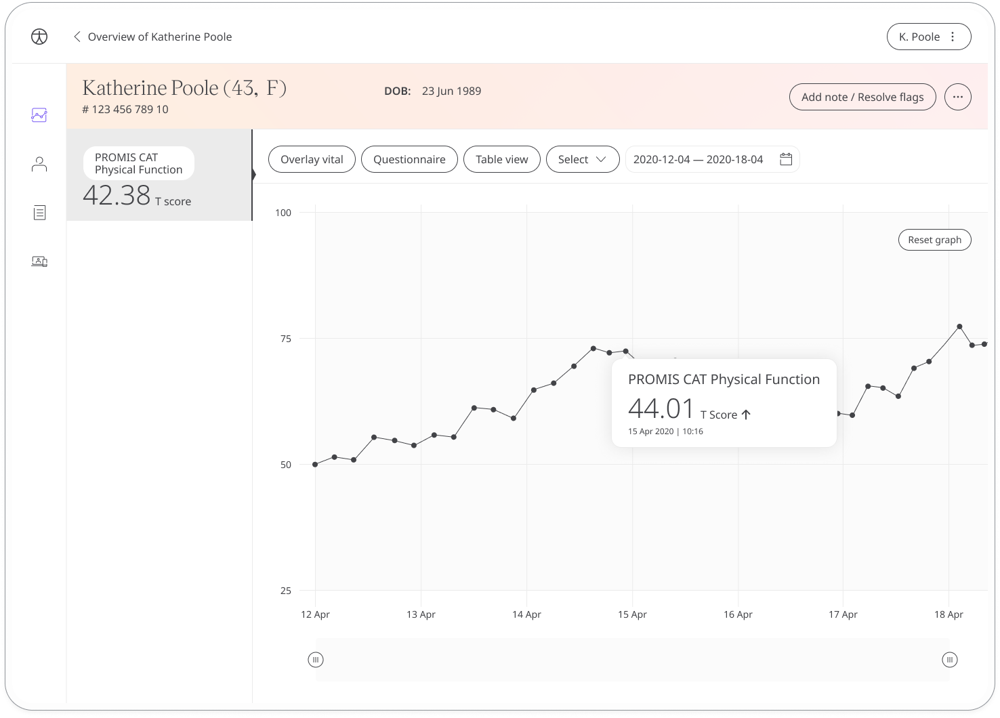

The PROMIS physical function questionnaire assesses patients with musculoskeletal problems in terms of how they function whilst performing their daily activities. Responses are shared with care teams to gather insight to provide appropriate and timely healthcare.

## How it works

Patients respond to questions about daily activities and answer from a set of multiple choice options that measure how they feel. The assessment uses computerised adaptive testing (CAT) which means the questions adapt to the user's ability level. 

## Patients

To start, patients select the PROMIS CAT Physical Function module and click **Add**. When they have answered all the questions, they will be assigned a score that is shared with their care team. From within the module, patients can view their progress in a graph and also access all their previous results. Daily, weekly, or monthly reminders can be set to help stay on track.

In the Care Portal, care teams will see the latest PROMIS CAT Physical Function score for their patient, with concerning scores flagged for attention.
 

In the Patient Summary, care teams can view all historical data in graph or table form.

