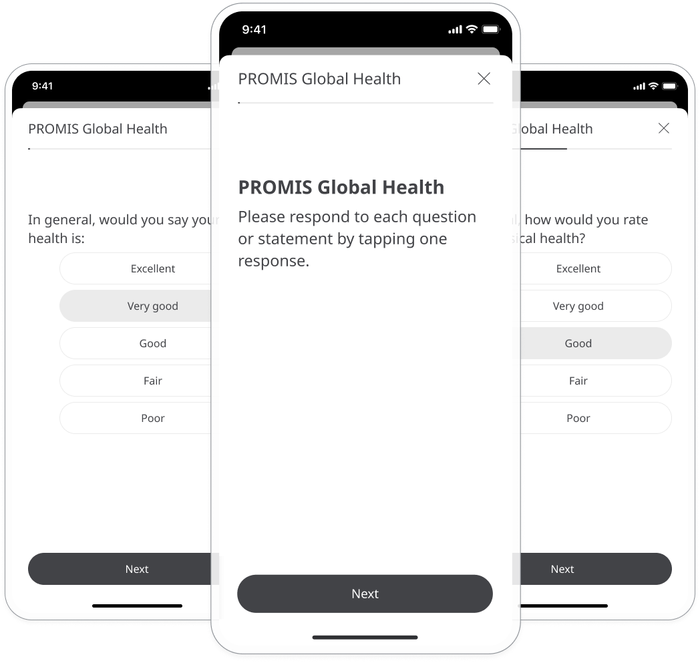
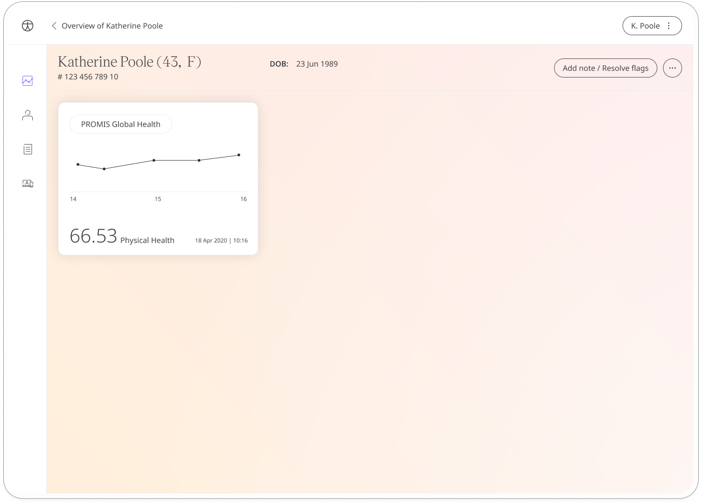
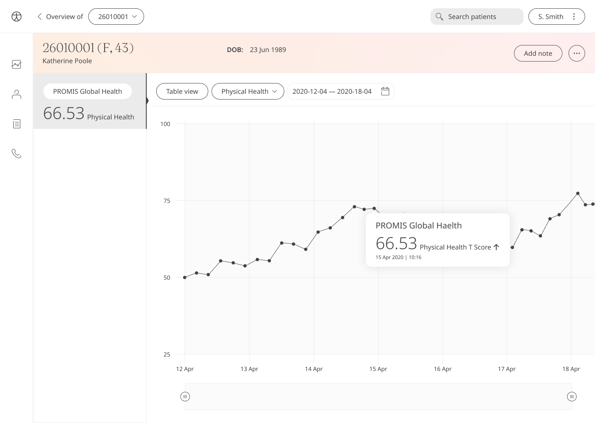

The patient-reported outcomes measurement information system (PROMIS) global health survey is a licensed questionnaire to assess a patient's health in terms of their physical, mental, and social wellbeing. Results are shared with care teams who can work with patients to provide the care that is needed.

## How it works

Patients respond to a set of 10 multiple choice questions to assess their physical and mental health. 

To start, patients select the PROMIS Global Health module and click **Add**. When they have answered all the questions, they will be assigned scores in the categories of physical health and mental health that are shared with their care team. From within the module, patients can view their progress in a graph and also access all their previous results. Daily, weekly, or monthly reminders can be set to help stay on track.

In the Care Portal, care teams will see the latest PROMIS Global Health score for their patient, with concerning scores flagged for attention.

In the Patient Summary, care teams can view all historical data in graph or table form.

