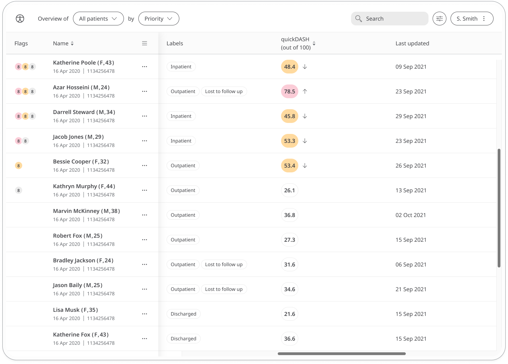

Post-surgery care is key to successful recovery from any surgery for a patient. The Disabilities of the Arm, Shoulder and Hand (DASH) questionnaire is a 
self-administered region-specific outcome instrument developed as a measure of self-rated upper-extremity disability and symptoms. 
Patient's feedback is shared with their care teams in order to provide the best post-surgery care.

## How it works

Patients are asked a series of multiple-choice questions about how they feel. The DASH consists mainly of a 30-item disability/symptom scale, 
scored 0 (no disability) to 100.
   
To start answering the questionnaire, patients select quickDash Questionnaire and click **Add**. 
From within the module, patients can view their progress in a graph and also access all their previous results. 
Daily, weekly, or monthly reminders can be set to help stay on track.

In the Clinician Portal, care teams will see the latest Dash Disability/Symptom Score for their patient, with concerning scores flagged for attention.

In the Patient Summary, care teams can view all historical data in graph or table form.

