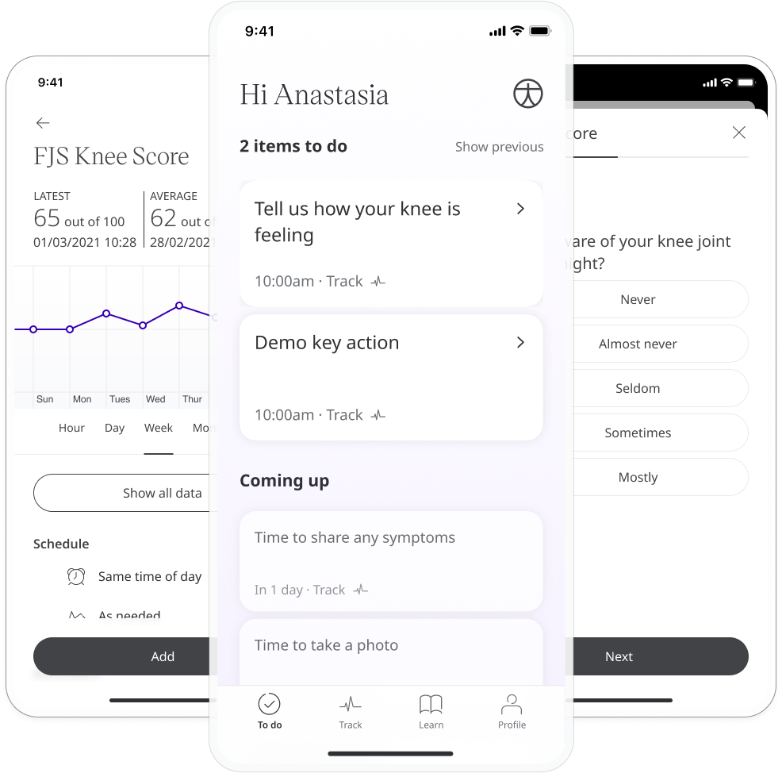
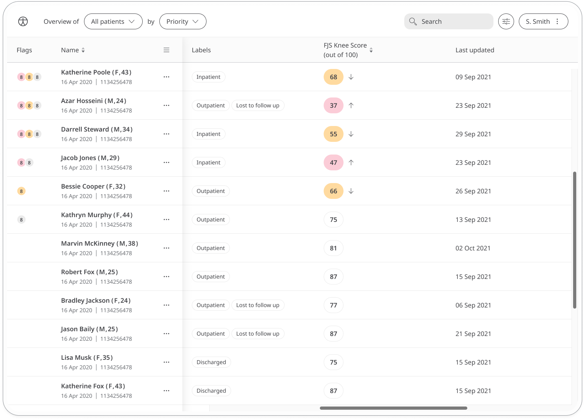

Good knee mobility is key to performing many regular activties, such as walking and standing. People are not generally aware of their joints until there is an issue. The Forgotten Joint Score Knee questionnaire aims to draw a patient's attention to their knee joint in order to help with early diagnosis of issues.

## How it works

Patients answer a number of multiple choice questions about knee joint awareness. At the end of the questionnaire, they are assigned a score out of 100 which is shared with their care team. To start, patients can select the FJS Knee Score module and click "Add". From within the module, patients can view their progress in a graph and also access all their previous results. Daily, weekly, or monthly reminders can be set to help stay on track.

In the Clinician Portal, care teams will see the latest FJS Knee score for their patient, with concerning scores flagged for attention.

