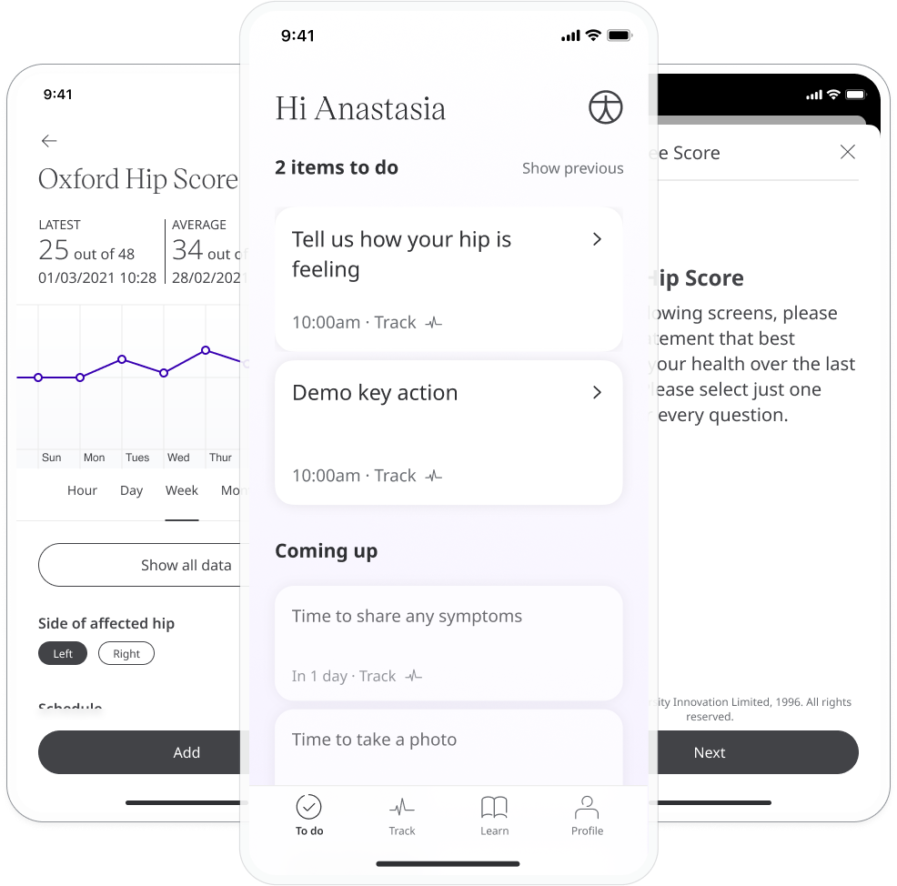
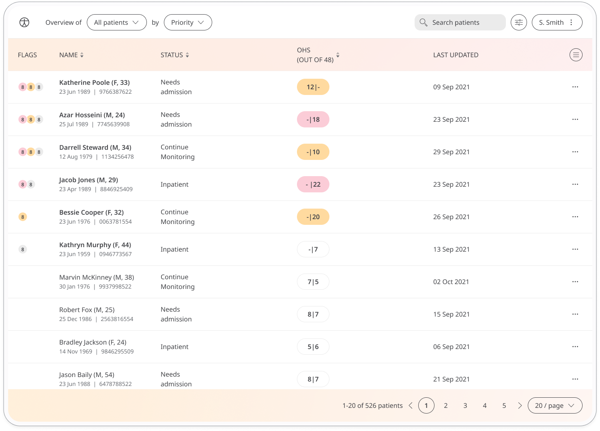
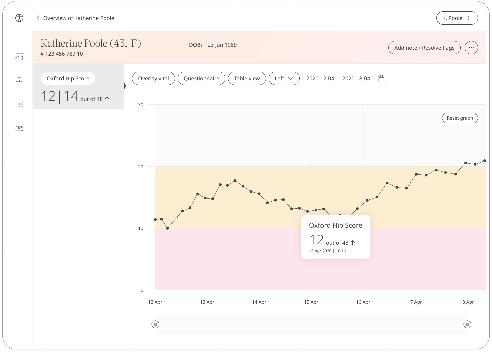

Post-surgery care is key to successful recovery from any operation. The Oxford Hip Score questionnaire is a quick and effective way to ask the patient about function and pain after total hip replacement. Their feedback is shared with their care teams in order to provide the best post-surgery care. 

## How it works

Patients are asked a series of multiple-choice questions about how they feel and are assigned a score out of 48, where a lower score represents a better hip function.

To start, patients select the Oxford Hip Score module and click **Add**. From within the module, patients can view their progress in a graph and also access all their previous results. Daily, weekly, or monthly reminders can be set to help stay on track.

## Clinicians

In the Clinician Portal, care teams will see the latest Oxford Hip Score for their patient, with concerning scores flagged for attention. 

In the Patient Summary, care teams can view all historical data in graph or table form.

