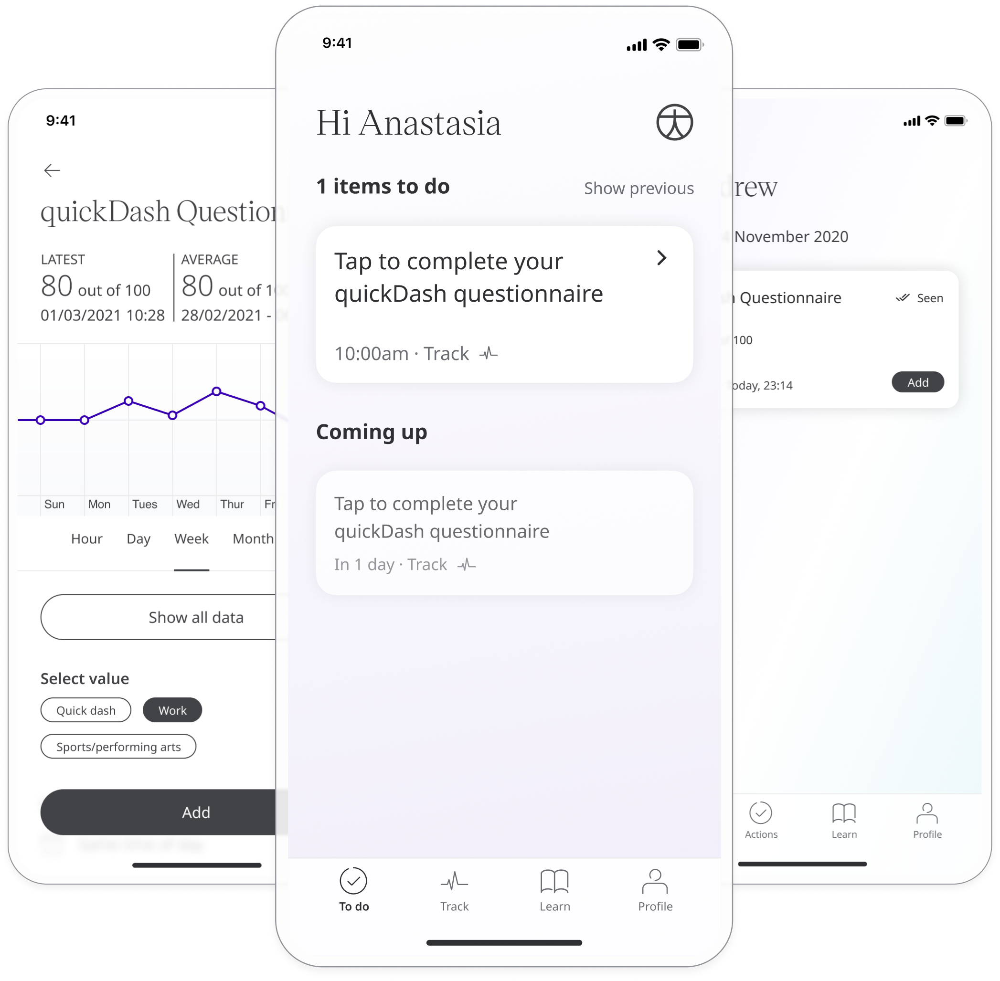
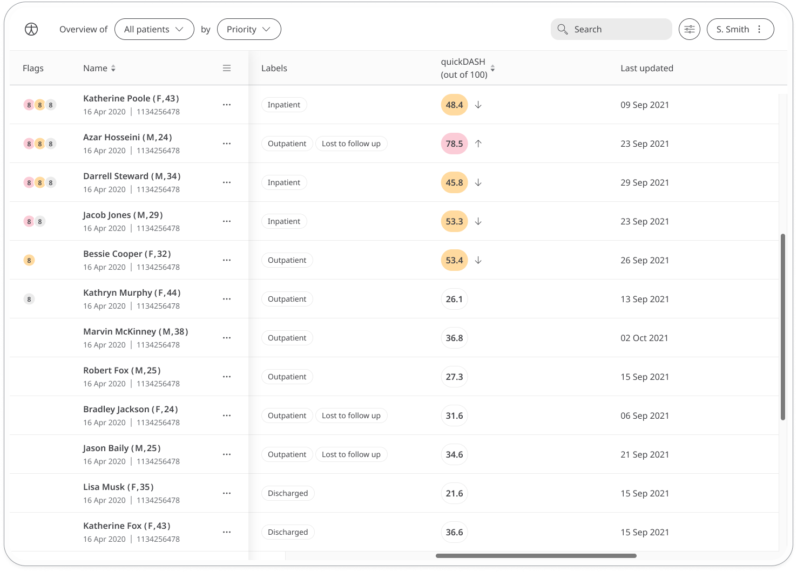
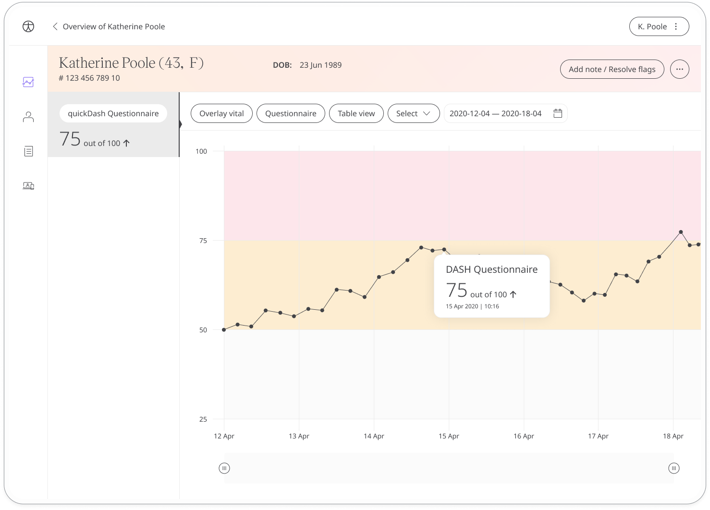

The disabilities of the arm, shoulder and hand (DASH) questionnaire is a self-administered region-specific outcome tool to measure the physical function and symptoms of patients with one or multiple musculoskeletal disorders of the upper limb.

The quickDASH is a shortened version of the DASH questionnaire to help orthopaedic clinicians quickly assess patients.

## How it works

The quickDASH consists of an 11-item disability/symptom scale scored from 0 to 100, with 0 indicating no disability and 100 indicating the most severe disability.  Patients will be asked about their ability to perform certain tasks using their arm or hand in order to measure the impact of their joint issue on daily life. 
   
To start answering the questionnaire, patients select quickDash Questionnaire and click **Add**. 
From within the module, patients can view their progress in a graph and also access all their previous results. 
Daily, weekly, or monthly reminders can be set to help stay on track.

In the Care Portal, care teams will see the latest quickDash score for their patient, with concerning scores flagged for attention.

In the Patient Summary, care teams can view all historical data in graph or table form.

