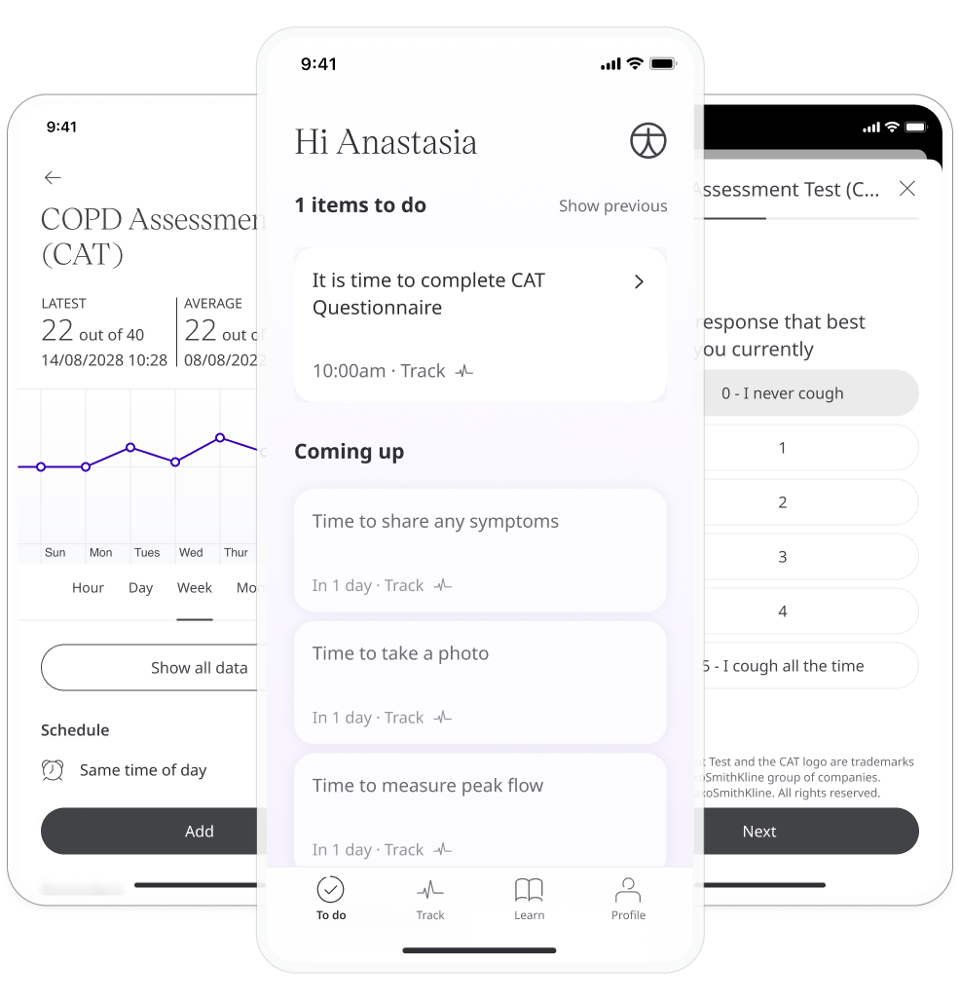
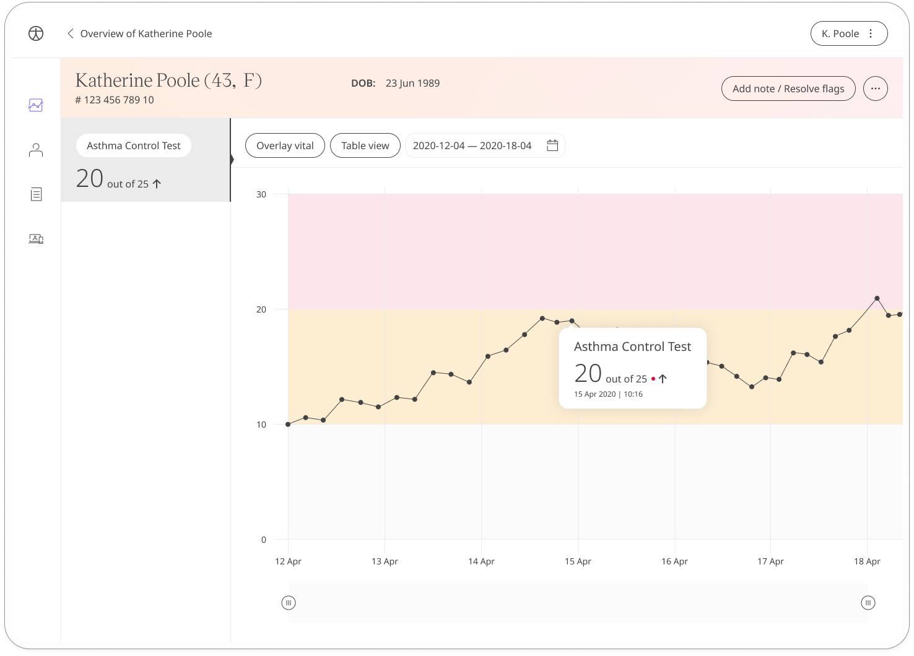

The Asthma Control Test is a questionnaire where patients answer 5 questions about their asthma symptoms over the previous 4 weeks to help their care team asses the severity of their condition.

## How it works

Patients answer questions about their asthma symptoms and their impact on daily life. Questions are scored on a scale from 1-5, giving them a total score out of 25, which is shared with care teams via the Clinician Portal.

To start, patients select the ACT module and click **Add**. When they have answered all the questions, they will be assigned a score that is shared with their care team. From within the module, patients can view their progress in a graph and also access all their previous results. Daily, weekly, or monthly reminders can be set to help stay on track.

In the Clinician Portal, care teams will see the latest COPD assessment test score for their patient, with concerning scores flagged for attention.

The Patient Summary displays a more detailed view of the patient's historic readings in graph or table form.

