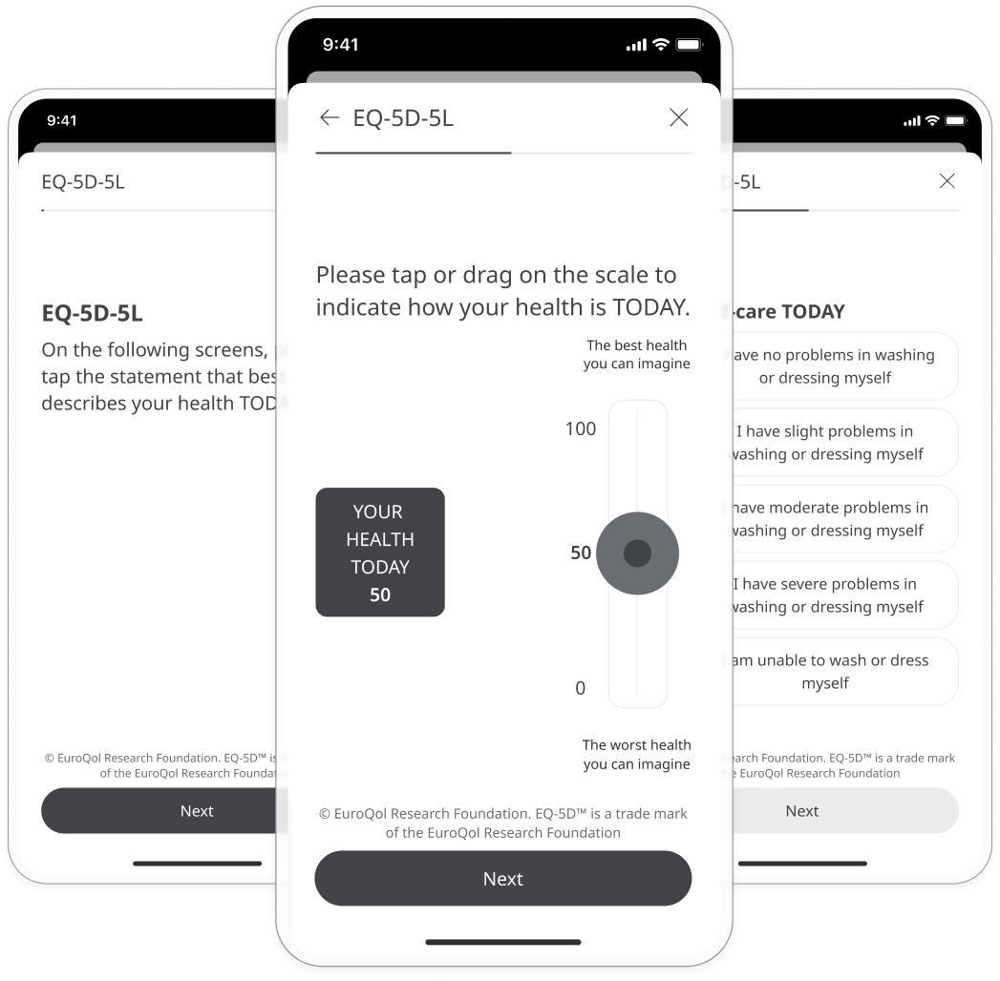
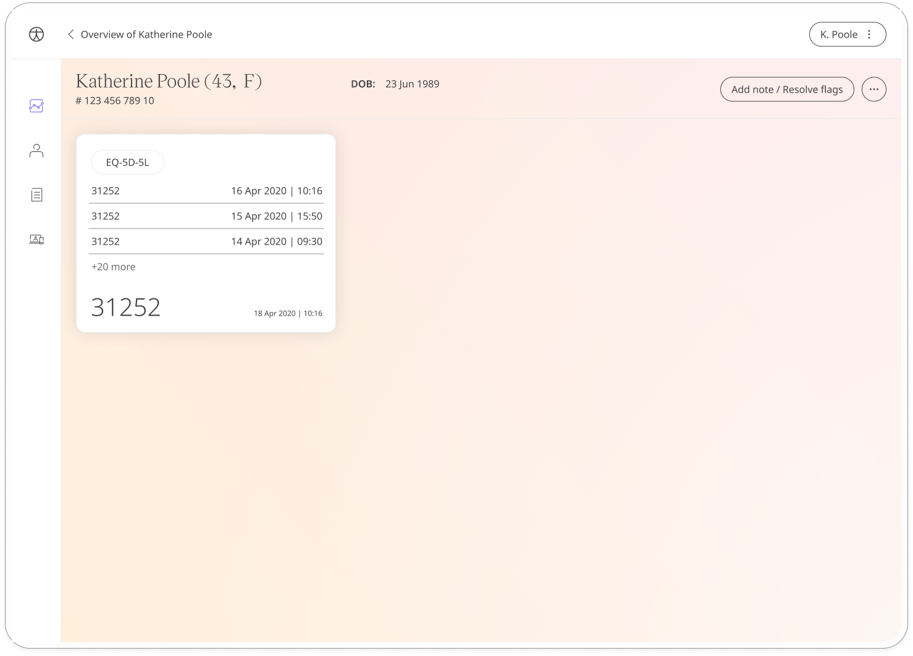
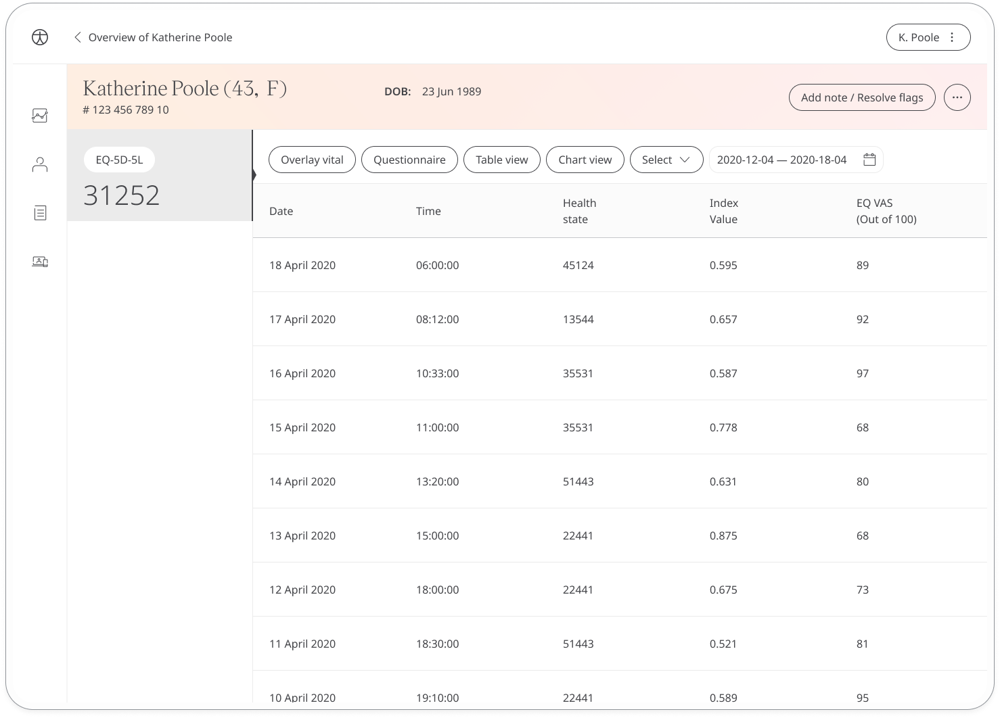

The EQ-5D-5L is a licensed quality-of-life PROM questionnaire where patients make a self-assessment about their current state of wellbeing. The questionnaire allows patients to use the Huma App to continually evaluate their quality of life and share their responses with care teams in order to make more informed decisions about their healthcare.

 It is also a valuable tool in research that could be used to measure, compare and value health status across disease areas.

## How it works

Patients answer questions about their mobility, self-care, regular activities, pain/discomfort, and anxiety/depression. Some questions are scored on a scale while others are more qualitative. The responses are converted into an index value between 0-1 and an EQ VAS score out of 100 which are both shared with care teams via the Clinician Portal.

To start, patients select the **EQ-5D-5L module** and click **Add**. When they have answered all the questions, they will be assigned a score that is shared with their care team. From within the module, patients can view their progress in a graph and also access all their previous results. Daily, weekly, or monthly reminders can be set to help stay on track. 

In the Clinician Portal, care teams will see the latest EQ-5D-5L score for their patient, with concerning scores flagged for attention.

In the Patient Summary, care teams can view all historical data in graph or table form.

