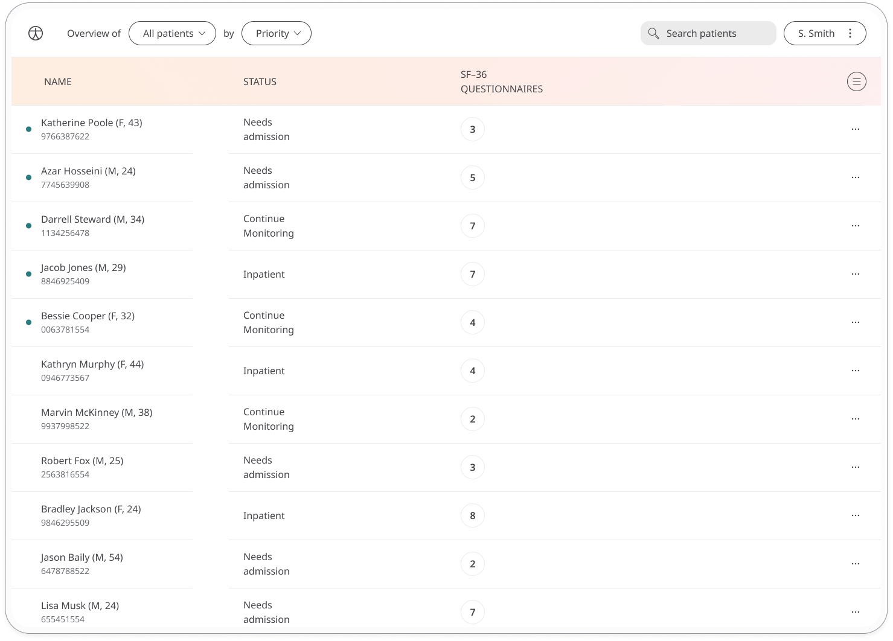
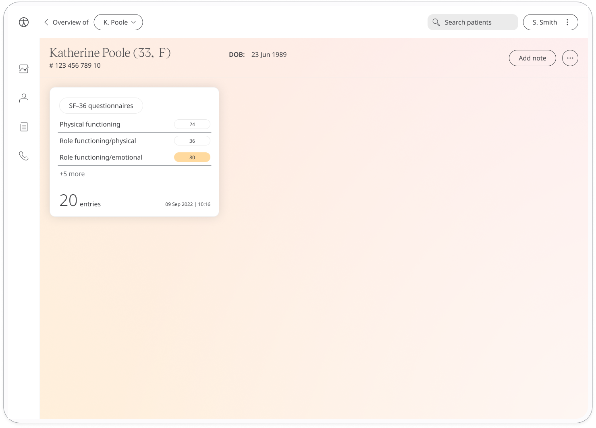

Assessing a patient’s self-reported quality of life, functional health and well-being is a good way to evaluate their overall health status. The Short Form Health Survey (SF-36) is a licensed PROM questionnaire which asks for the perspective of the patient when it comes to their ability to fulfil daily functions. Results are shared with care teams who can work with patients to provide the care that is needed.

## How it works 

Patients respond to questions that assess their wellbeing across 8 categories:
- Physical function
- Role functioning/physical
- Role functioning/emotional
- Energy/fatigue
- Emotional well being
- Social functioning 
- Pain
- General Health

To start, patients select the SF-36 module and click "Add". When they have answered all the questions, they will be assigned a score out of 100 for each of the eight categories, with 100 representing the highest level of functioning, which are then shared with their care team. From within the module, patients can view their progress in a graph and also access all their previous results. Daily, weekly, or monthly reminders can be set to help stay on track.

In the Clinician Portal, care teams will see the latest SF-36 score for their patient, with concerning scores flagged for attention.

In the Patient Summary, care teams can view all historical data in graph or table form.

