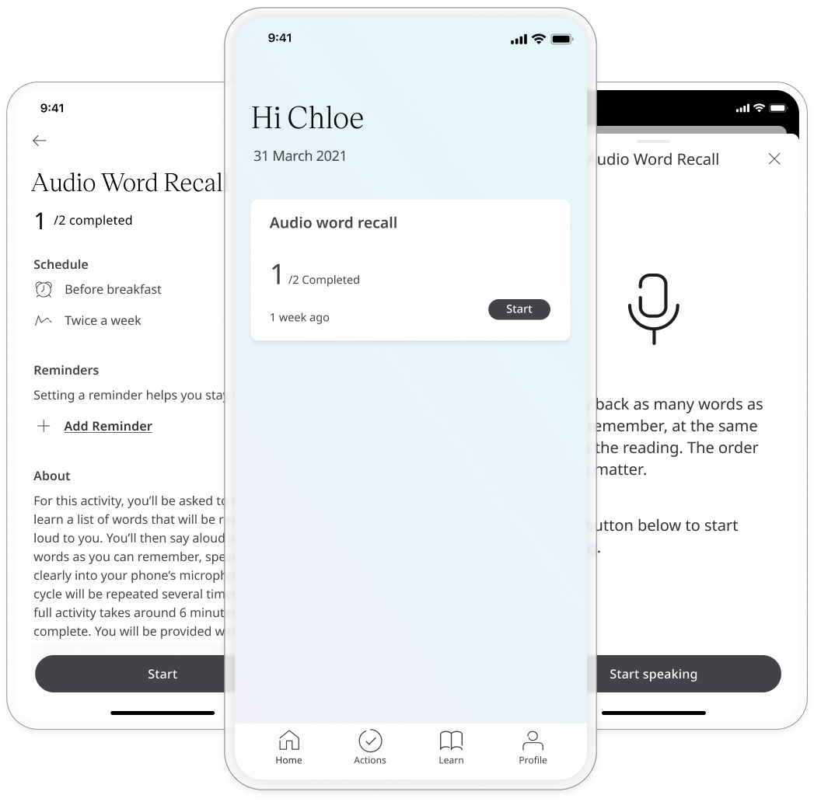

** Evaluating verbal memory **

The Rey Auditory Verbal Learning Test (RAVLT) provides a standardised procedure to evaluate a range of aspects of verbal learning and memory of supra-span lists of words.

## How it works

### Patients

In the Huma App, Patients can select the Audio Word Recall module and by pressing the “Start” button to begin the activity.

In this module, the patient will be asked to listen to a list of words that will be read out loud to them. Afterwards, they then say back as many words as they can remember, speaking clearly into your phone’s microphone. This cycle will be repeated several times. Patients will be provided with step-by-step instructions throughout the activity. 

Note: The test is meant to be difficult and Patients should not be alarmed if they cannot complete the full task

### Clinicians

This module helps Patients to understand their health and to help with decisions in their lifestyle and therefore the data collected is not viewable from the Clinician Portal.
