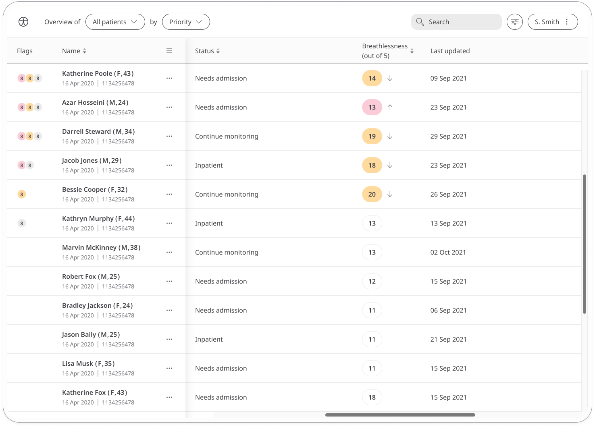
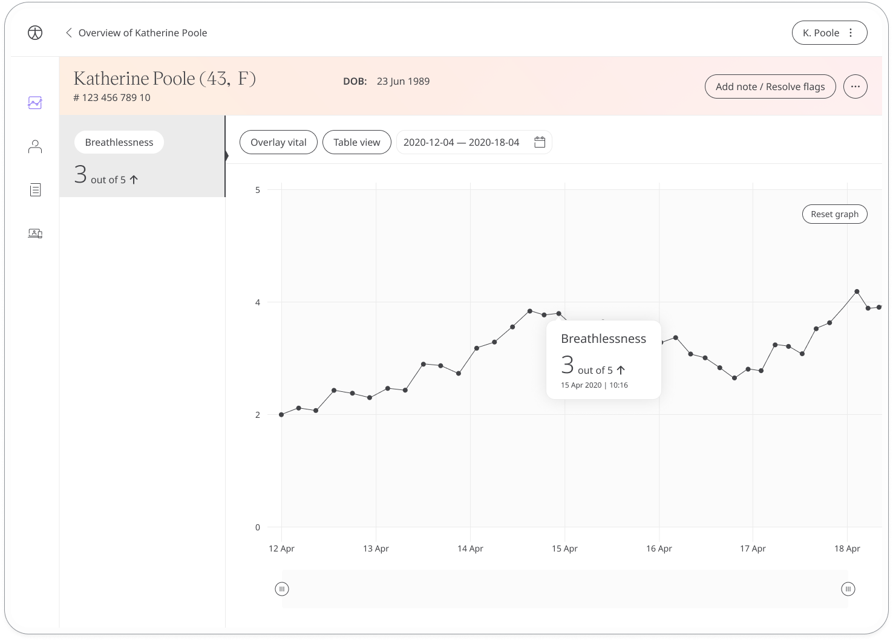

Shortness of breath can be caused by conditions such as asthma, chest infections, or from smoking but can also be a sign of something more serious. This module provides a quick assessment to understand the degree of breathlessness patients are experiencing. Care teams can use this information to track lung function over time and provide insight or recommendations to patients.

## How it works

The Breathlessness module asks patients to answer a simple question about their degree of breathlessness. Their response is converted into a score out of 5 which is shared with their care team, allowing them to monitor their level of breathlessness over time.

Patients can view their historic breathlessness scores in a graph. In the Care Portal, care teams will be able to see the latest breathlessness scores from their patients. 

The Patient Summary displays a more detailed view of the patient's historic scores in graph or table form.

