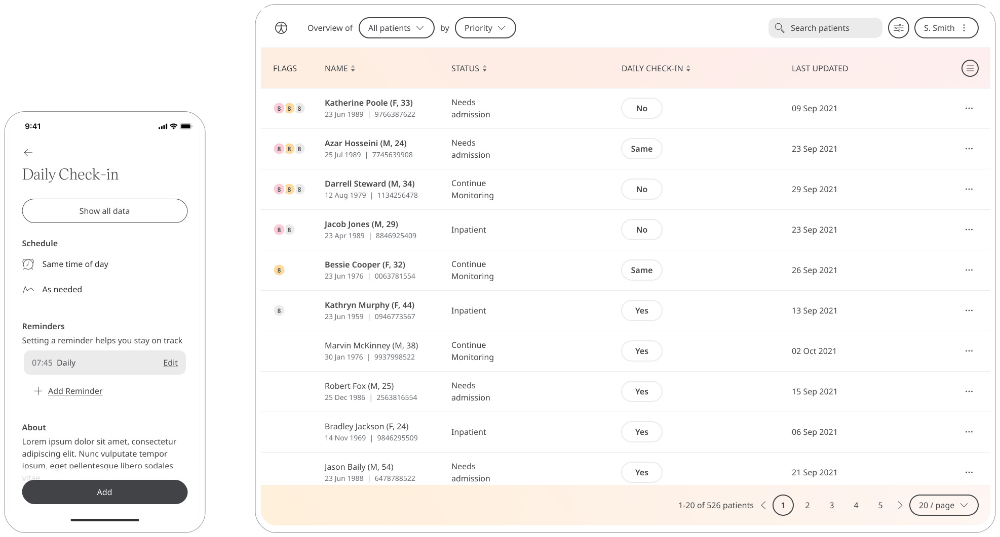

	
By tracking how they feel every day, Patients help Care Teams understand how they can offer better support.

## How it works

### Patients

In the Huma App, Patients can select the Daily Check-In module and by pressing the “Add” button can answer the question “Are you feeling better than yesterday?”. 

To view historic answers, Patients can see a table of them by pressing “Previous entries”.

### Clinicians

In the Clinician Portal, on the Patient List, Clinicians can view a table of Patients, from which the Daily Check-In column will display the last recorded reading.

Clicking on the Patient row takes the Clinician to the Patient Summary where all vitals can be viewed, by selecting the Daily Check-In module all historic data can be displayed as a graph or a table of results.

