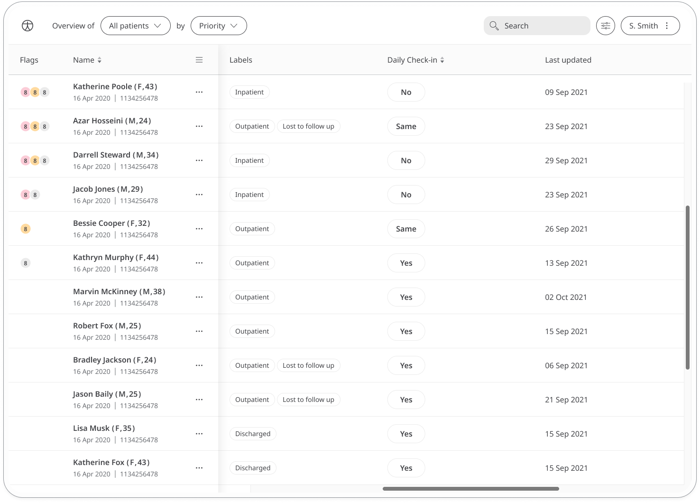

	
The daily check-in provides a way for patients to record how they are doing on a day-to-day basis, helping care teams understand how they can offer better support.

## How it works

The Daily Check-In module asks patients to answer a simple question; “Are you feeling better than yesterday?”. They can answer "Yes", "No" or "Same".

Both patients and their care teams can review their answers to this question to notice how their general wellbeing fluctuates. In the Clinician Portal, care teams can easily see the patient's last recorded reading in the Daily Check-In column.

In the Patient Summary, all historic data concerning the patient's daily check-in reponses can be displayed as a graph or a table of results.

