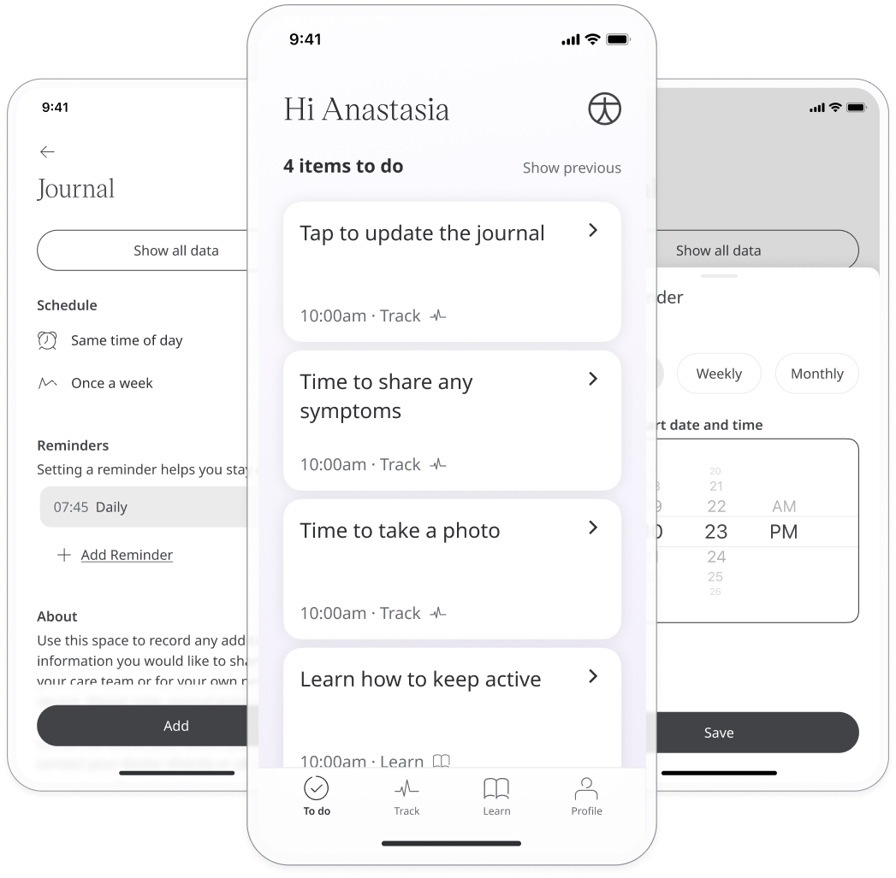
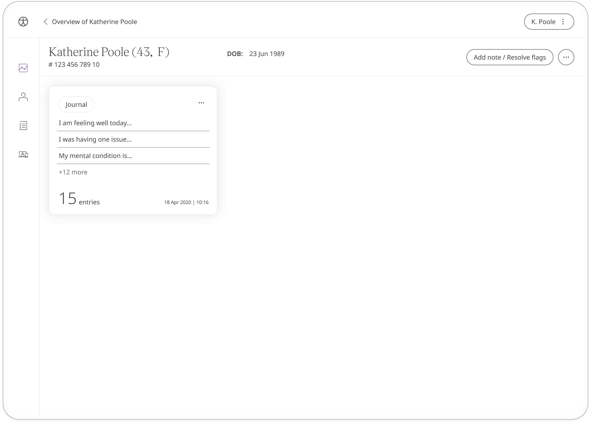
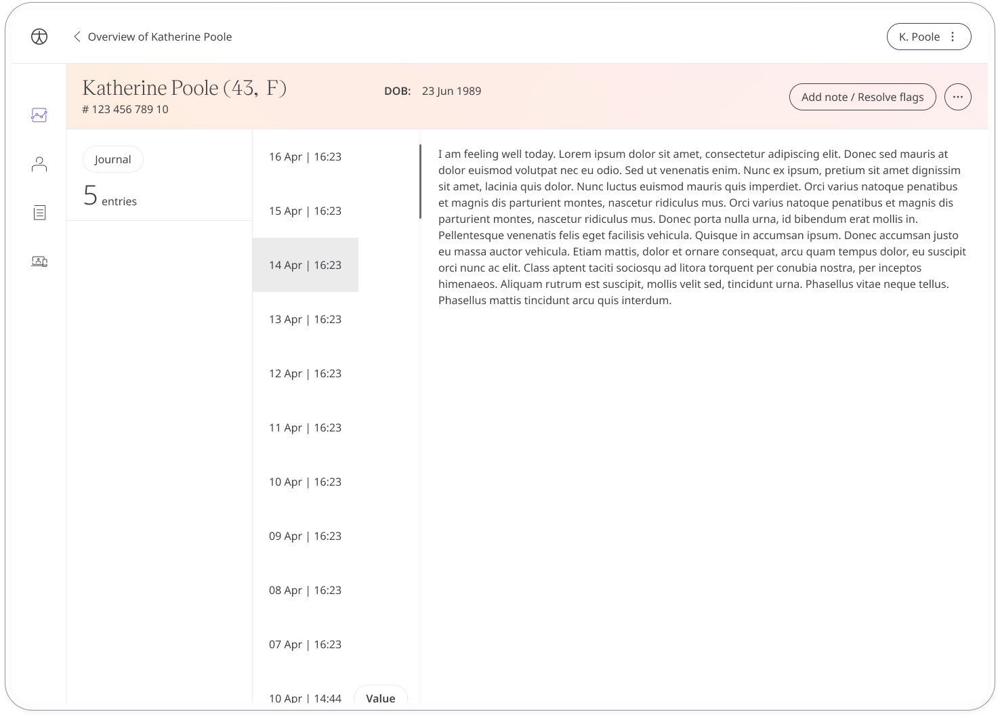

Unlike some of the other more prescriptive modules, the Journal module allows patients a way to reflect on how they feel in a more subjective manner.

## How it works

Just like any journal, patients can note down and share with their care team anything they feel is appropriate to their health but not covered by other modules.

Patients can view their past entries from within the Huma App. In the Clinician Portal, care teams can also view all data submitted to the journal.

