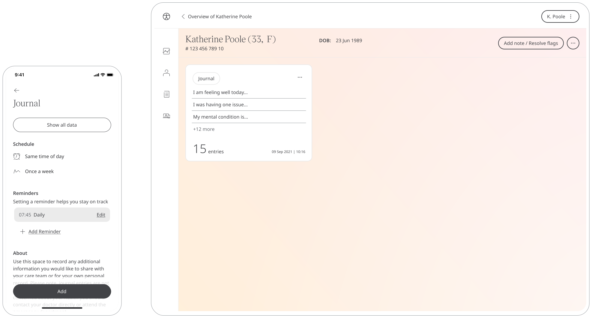

** Allowing app users to document anything that they would like to share with their Care Team. **

As Patients are on their Health Care journey with Huma, having the means to reflect on how we feel is an important part of moving forward. With the Journal module, Patients can note down anything they feel is appropriate to their health. In addition, Journal entries are shared with the Care Teams so they can gather insight and look for any trends.

## How it works

### Patients 

In the Huma App, Patients can select the Journal module click “Add” and just type what they want to record.

To view historical entries, Patients can see a table of them by pressing “View X entries”.

### Clinicians

In the Clinician Portal, on the Patient Summary, Clinicians can view all data submitted, from which the Journal module will show the historic entries from the Patient.

