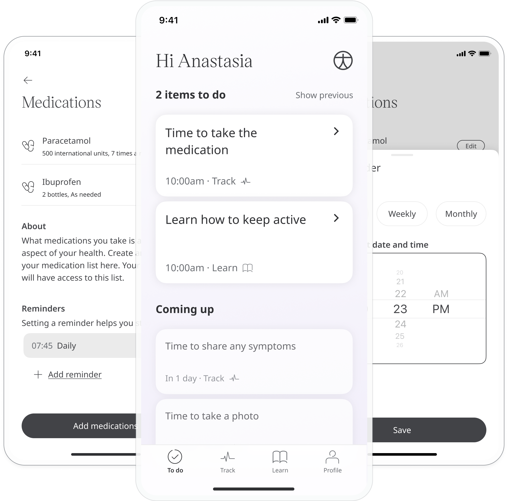
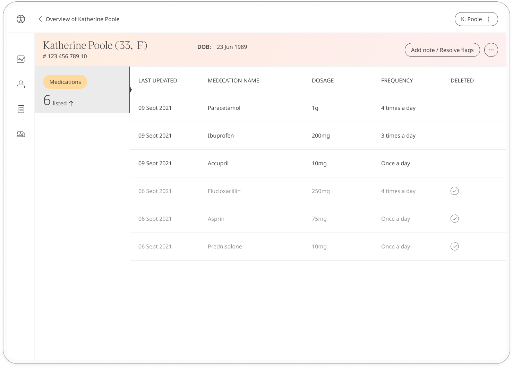

It is important that both patients and their care team can keep track of and share changes to any patient medications. The Medications module allows patients or their care team to make a log of the medications they are taking along with their dosage and frequency. In addition, it allows them to keep track of when and how much they need to take via a notifications system.

## How it works

Patients or their care teams can enter the names of any medications they are taking plus the dosage and frequency. In the Medications module, they can view their list of added medications and change or delete them as necessary. Patients can also choose to set reminders for taking their medications.

In the **Medication log**, patients can see a historic view of the medications they have been taking and the **Medications list** is where they can view and edit their current dosages and schedule.

In the Patient Summary, care teams will be able to see the patient's listed medications along with their dosage and frequency. The patient's adherence to the schedule will also be shown.

The detailed view shows a list of the patient's current medications. From the **Adherence** column, clinicians can access a calendar view of the patients medication adherence for the current month or previous months. Clinicians can also see any previous medications by switching to the **Archived medications** view. New medications can also be added by the care team from this page.

