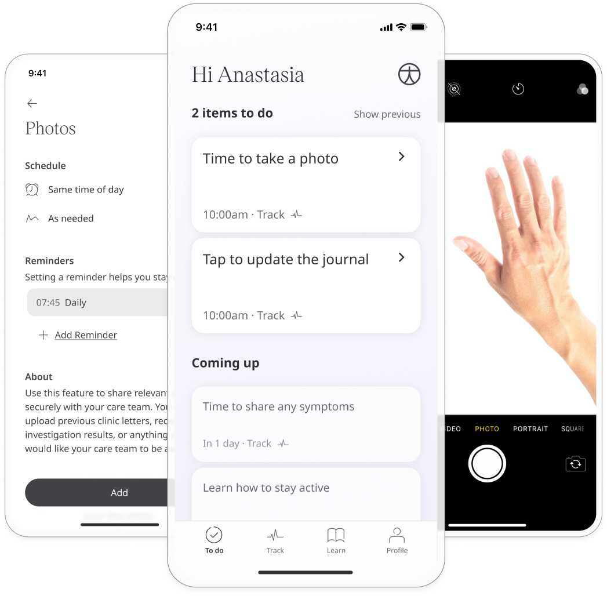
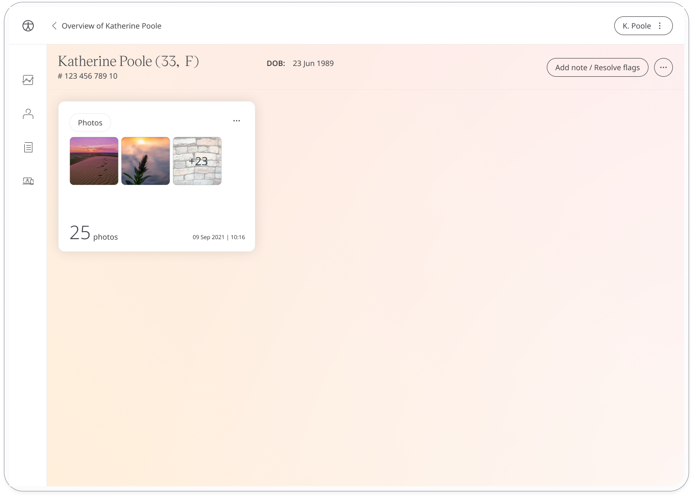
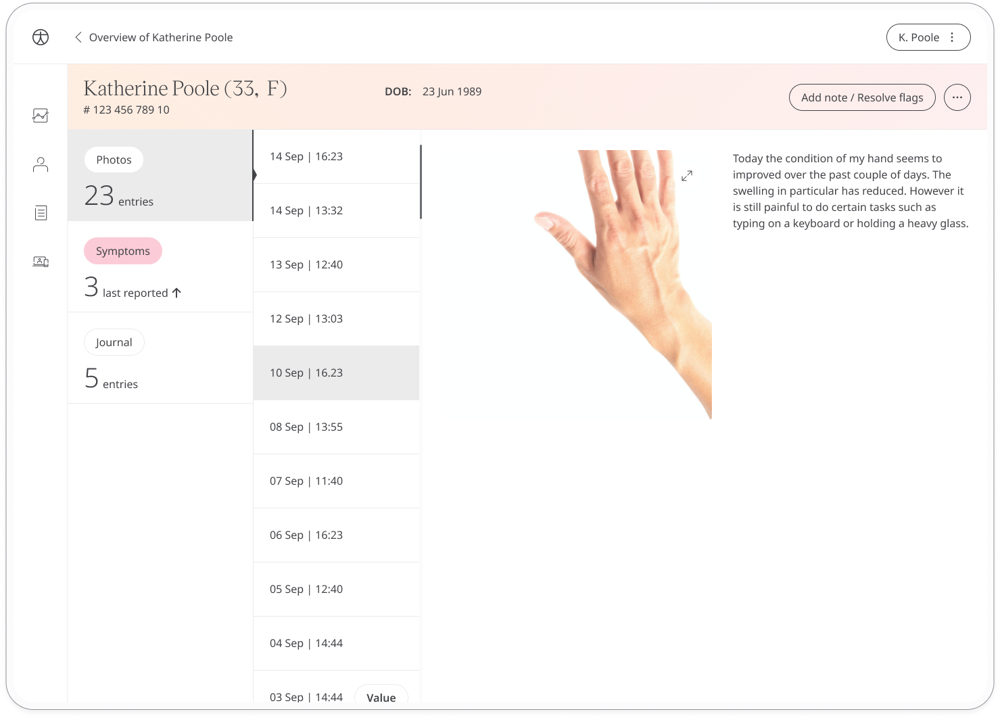

Huma provides quantifiable data and questionnaires from Patients to inform Care Teams about the care they provide. But being able to communicate certain intent can be challenging, therefore the Photo module is a reliable source of the information about the user’s health status, medical history, diet, activity, etc.

## How it works

## Patients

In the Huma App, Patients can select the Photo module and simply by clicking “Add” they are able to take a photo or upload one from the library, and to give it more context a note can be added below. Scrolling to the bottom of the module will show the previous entries under “History”.

## Clinicians

In the Clinician Portal, on the Patient Summary, Clinicians can view all data submitted, from which the Photos module will show the historic entries from the Patient. 

