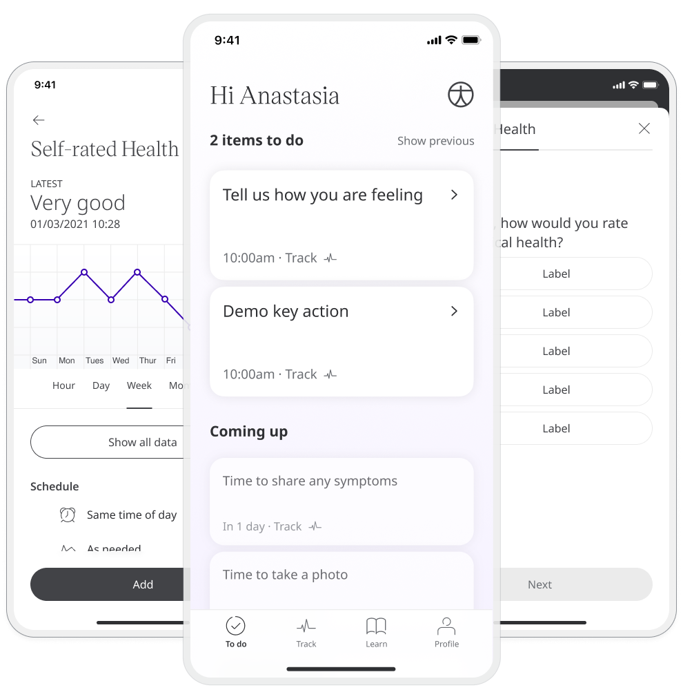
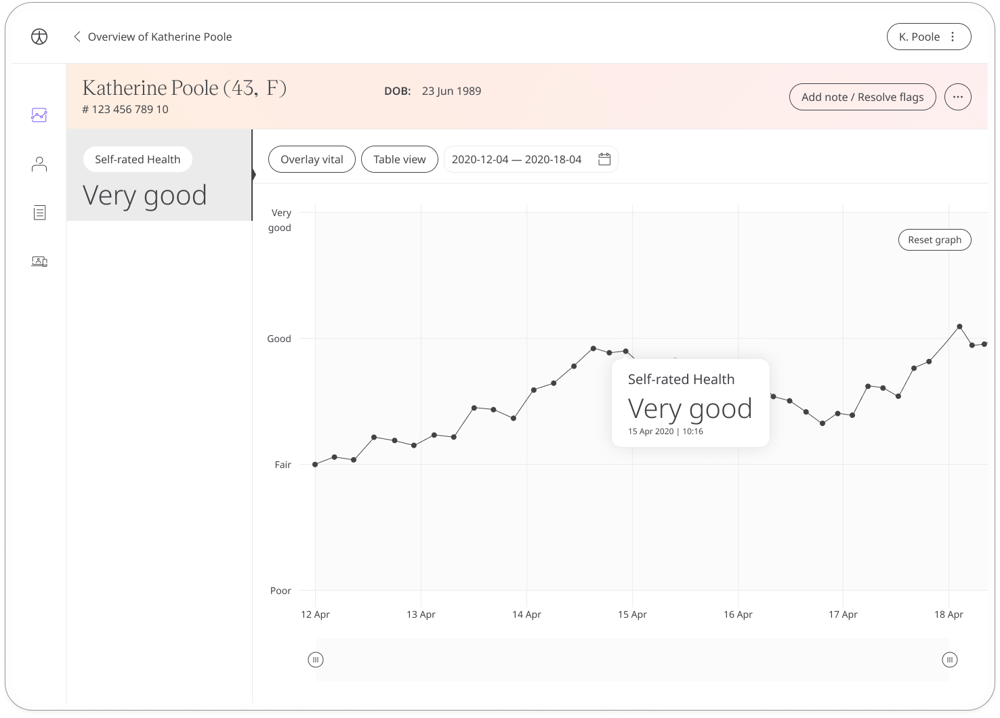

The Self-rated Health module provides a way for patients to record how they are doing on a day-to-day basis, helping care teams understand how they can offer better support.

## How it works

The module asks patients to answer a simple question; “In general, how would you rate your physical health?”. They can answer "Excellent", "Very Good", "Good",  "Fair" or "Poor".

Both patients and their care teams can review their answers to this question to notice how their general daily health fluctuates. In the Clinician Portal, care teams can easily see the patient's last recorded reading in the **Self-rated Health** column.

In the Patient Summary, all historic data concerning the patient's daily check-in reponses can be displayed as a graph or a table of results.

