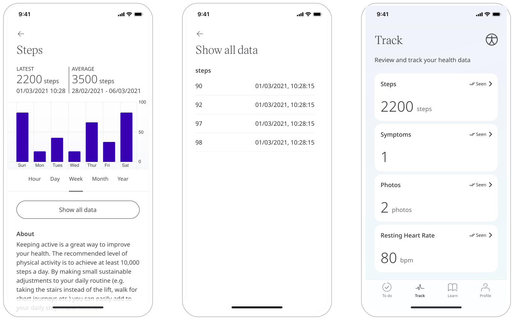
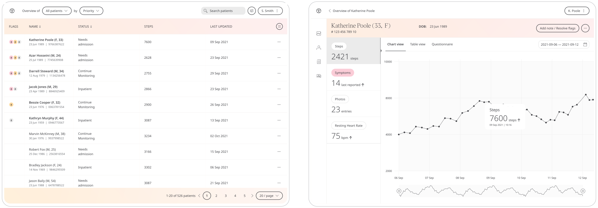

** Walking is a simple way to keep active **

Physical exercise is a good measure of a patient's health. Walking helps patients retain a certain level of physical fitness, even if their sickness or health condition prevents them from more intense forms of exercise.

Huma provides a way to send your step count from a Patient’s fitness tracker to their Care Team so they monitor activity.

## How it works

The Steps module uses the native fitness App, i.e. Apple Health and Google Fit, to retrieve a Patient step count and make it available in the Clinician Portal.

### Patients

In the Huma App, Patients can select the Steps module and simply by clicking Sync with Google Fit/Apple Health, and completing the steps, the data will automatically be populated in the Huma App.

From within the module, Patients can view their progress in a graph and press “Show all data” to view previous results in a table. 

### Clinicians

In the Clinician Portal, on the Patient Summary, Clinicians can view all data submitted, from which the Steps module will show the historic entries from the Patient.

