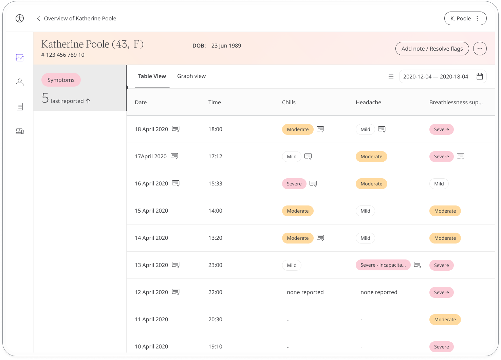
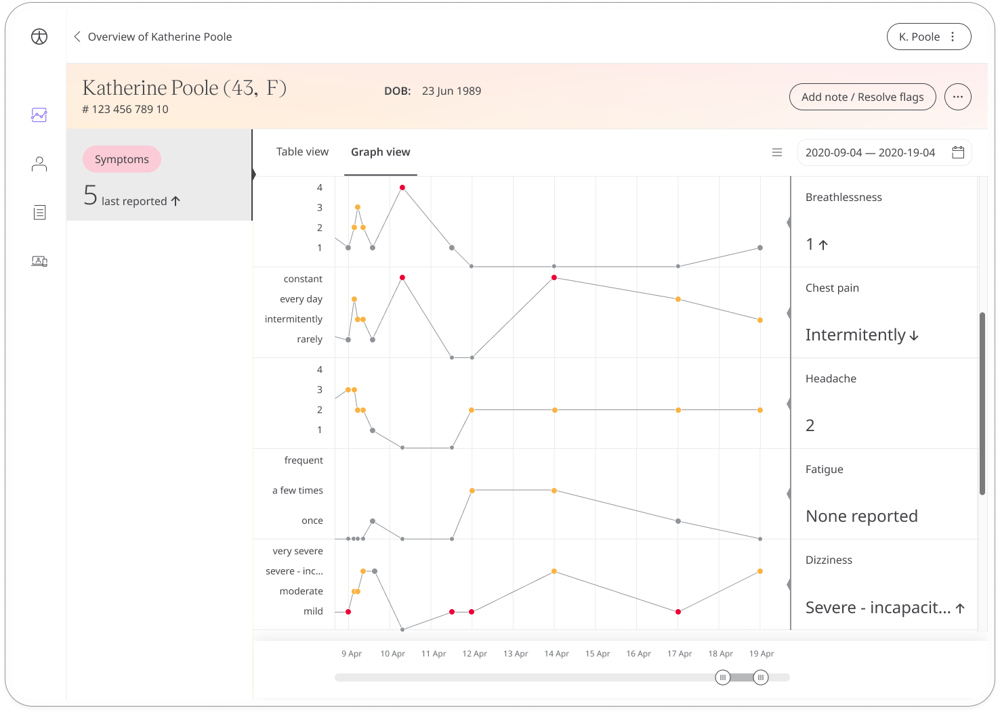

---
sidebar_position: 10
title: Symptoms 
--- 

The Symptoms module is used to record a patient's symptoms as they occur. Keeping a symptom diary provides their care team with a greater understanding of how they are feeling, allowing them to provide the best care possible.

## How it works

The Symptoms module is set up with a predefined list of symptoms. Each time the patient opens the module, they select the symptoms they are experiencing at that time and report how severely they are experiencing them. They may have additional questions to answer about the symptom, such as the frequency they experience it, depending on how the module has been configured. 

Patients can view data about each of their tracked symptoms in graph format to see how their symptoms have progressed over the year, month, week, day, or hour. They can also view all historic entries for each symptom including the time and date, the health data, or questionnaire responses.

Care teams get an overview of the number and severity of tracked symptoms along with the date of the last update from the Patient list.

From the patient’s dashboard, care teams can view a list of tracked symptoms along with their severity. A message icon indicates where there is additional information available from the patient. Click the icon to view the details.

The graph view is useful for showing trends.

