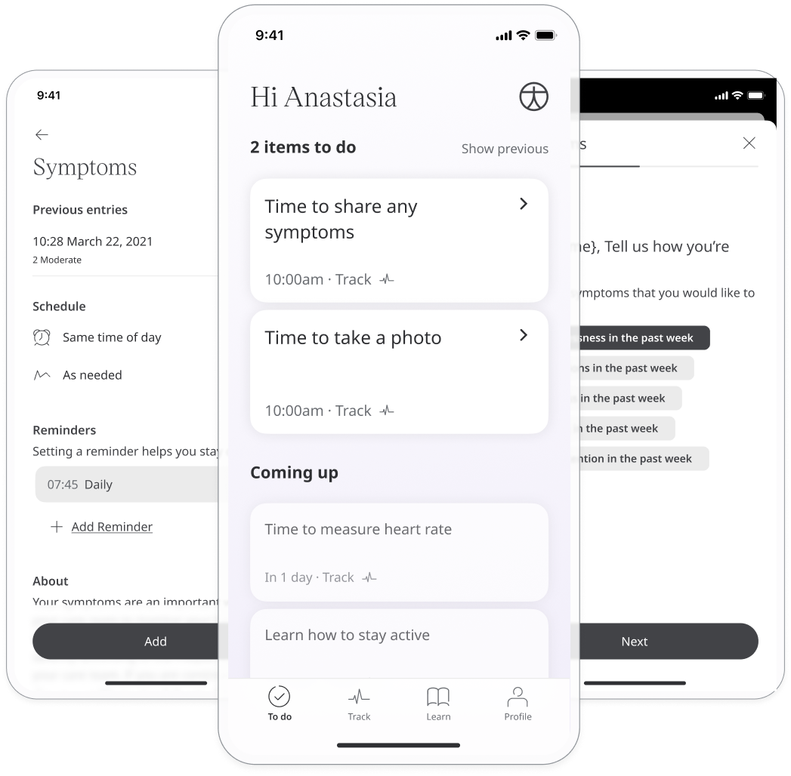
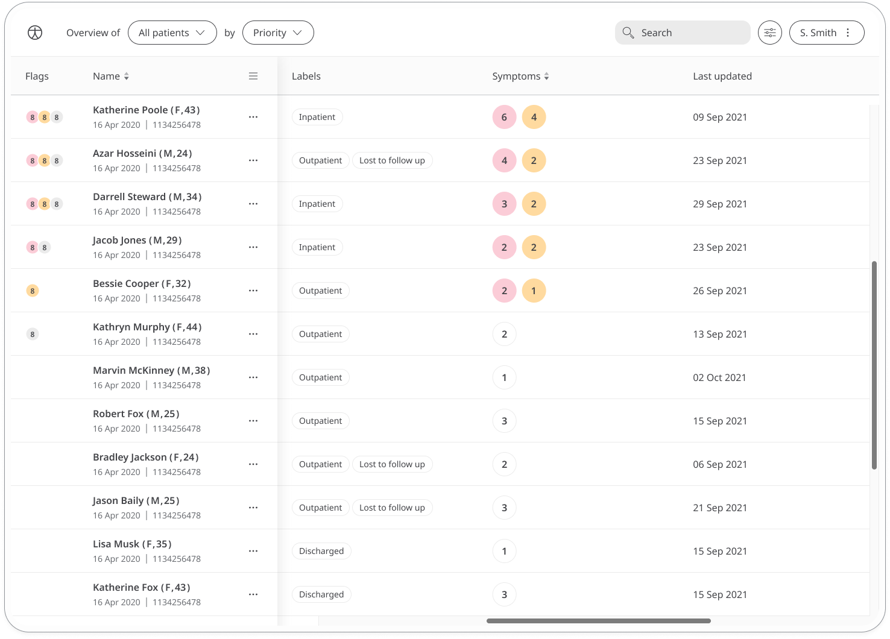
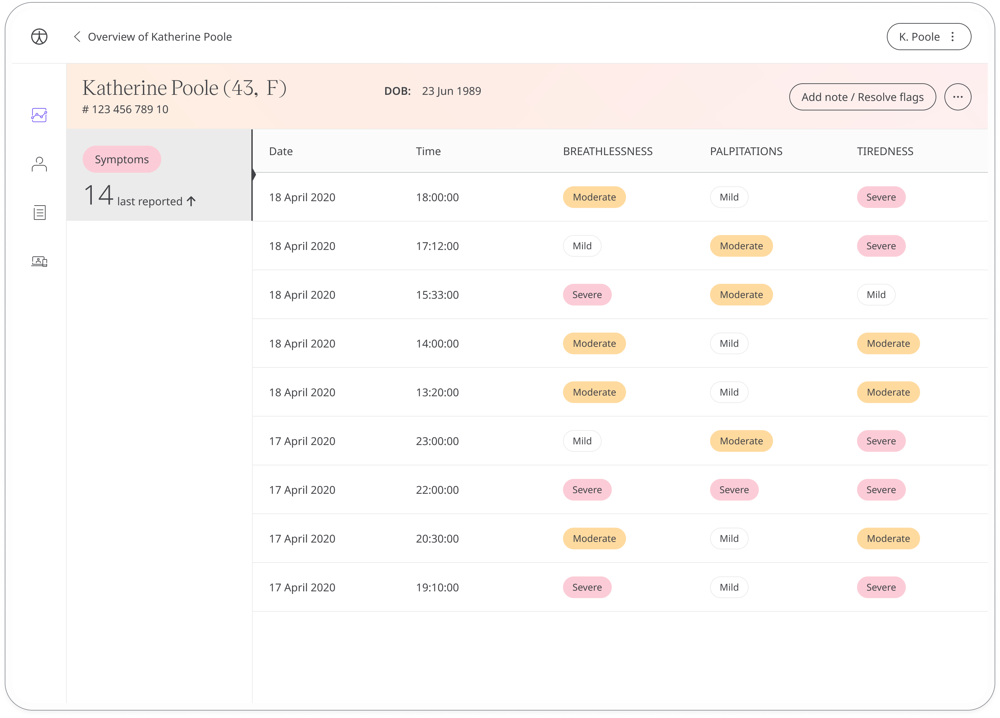

---
sidebar_position: 10
title: Symptoms 
--- 

The Symptoms module is used to record a patient's symptoms as they occur. Keeping a symptom diary provides their care team with a greater understanding of how they are feeling, allowing them to provide the best care possible.

## How it works

The Symptoms module is set up with a predefined list of symptoms. Each time the patient opens the module, they select the symptoms they are experiencing at that time and also how severely they are experiencing them. 

Patients can view theirr historic symptoms data and also set reminders for inputting their data to help them stay on track.

Care teams can access the symptoms module for their patients to see how each of their symtpoms is developing or improving over time.

