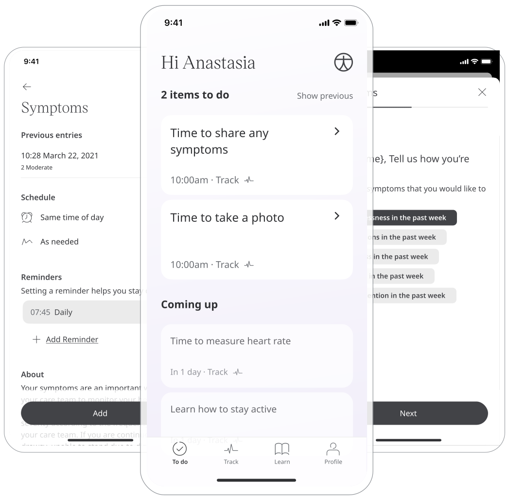
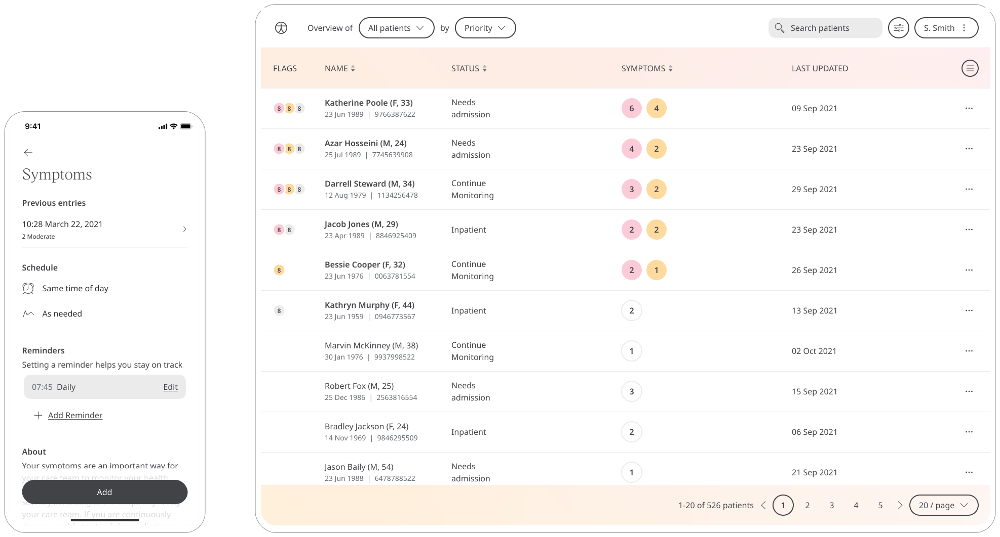
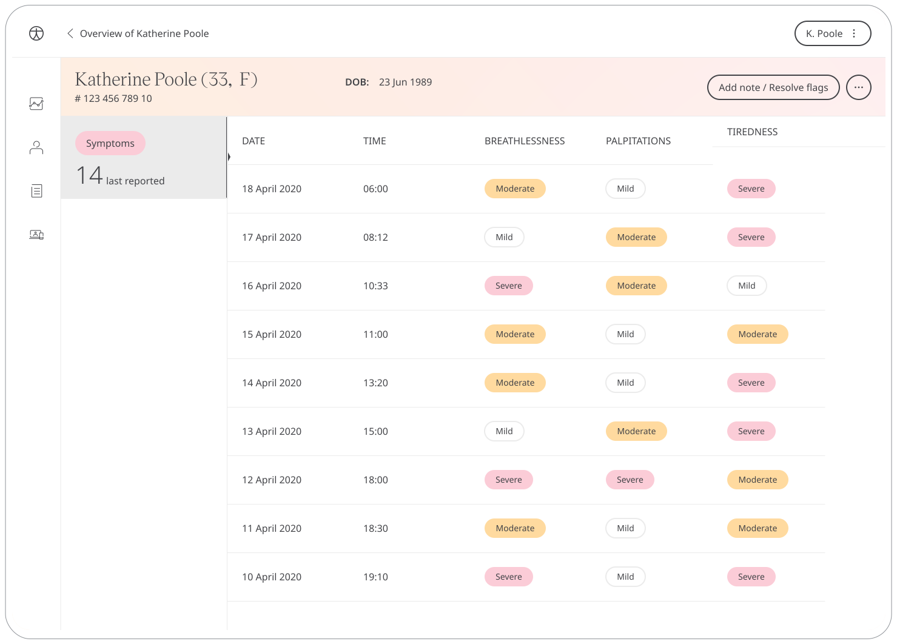

---
sidebar_position: 9
title: Symptoms 
--- 

** Recording symptoms as they happen. **

The Symptoms module is used to record a Patient's symptoms as they occur. Keeping a symptom diary provides their Care Team with a greater understanding of how they are feeling, allowing them to provide the best care possible.

## How it works

### Patients

In the Huma App, Patients can select the Symptoms module and simply by clicking “Add” they are able to select from a predetermined list of symptoms and how serious they feel that particular affliction. 

From within the module, Patients can view previous entries and can also set a daily, weekly, or monthly reminder to help keep on track.

### Clinicians

In the Clinician Portal, on the Patient Summary, Clinicians can view all data submitted, from which the Symptoms module will show the historic entries from the Patient.

