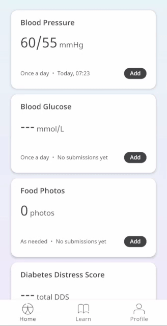
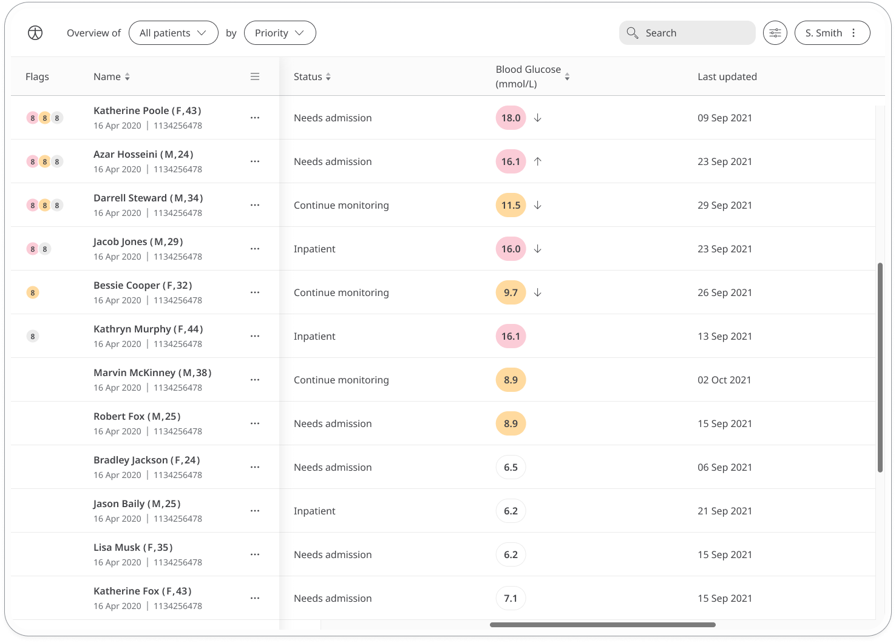

** Monitor Blood Glucose **

For many people, regular blood glucose monitoring is an important part of managing conditions like Diabetes. In order to help Patients make a good decisions about their health, the Blood Glucose module will record results and be made available to their Care Teams.

## How it works

Patients will measure their blood glucose using a Blood Glucose Monitor, and enter into the Huma App. From there, Clinicians can view new and historic results in the Clinician Portal and be informed on severity.  

### Patients

From the home screen, Patients can select the Blood Glucose Modules, and simply by clicking “Add” a result can be entered in mmol/L (millimoles per litre) with the time and date automatically added as now, but editable. 

From within the module, Patients can view their progress in a graph and press “Show all data” to view previous results in a table. Patients can also set a daily, weekly, or monthly reminder to help keep on track.

### Clinicians

In the Clinician Portal, on the Patient List, Clinicians can view a table of Patients, from which the Blood Glucose column will display the last recorded reading indicated as a Red Amber Green indicator to inform severity. 

Clicking on the Patient row takes the Clinician to the Patient Summary where all vitals can be viewed, by selecting the Blood Glucose module all historic data can be displayed as a graph or a table of results.