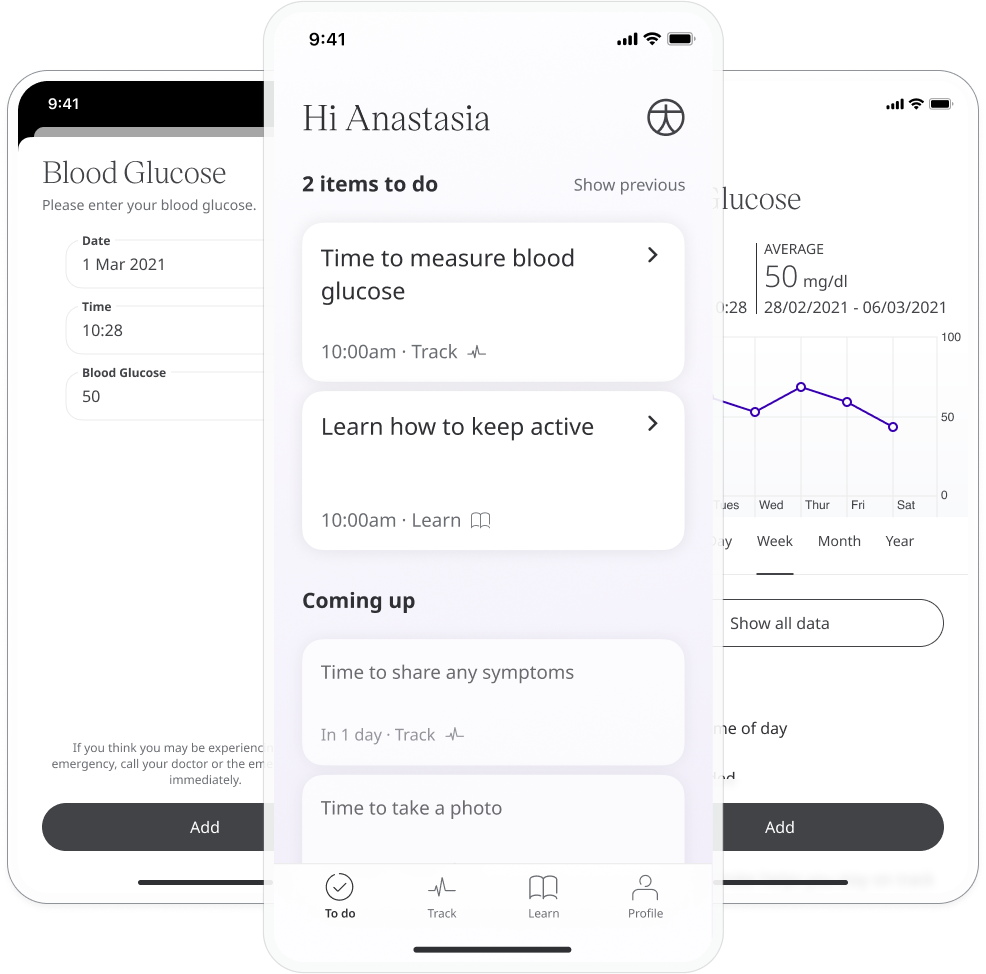
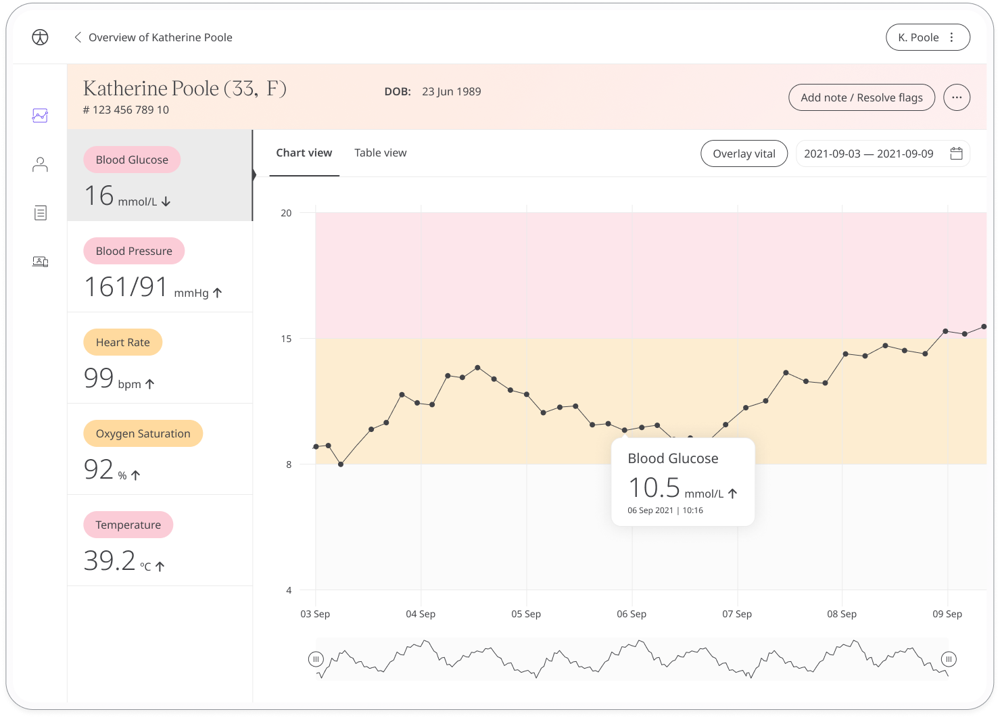

For many people, regular blood glucose monitoring is an important part of managing conditions like diabetes. 

## How it works

Patients measure their blood glucose using a blood glucose monitor and enter the reading into the Huma Care App. Care teams can easily view results and be informed of any concerning readings.

Patients input their result and the time and date is added automatically at the moment they make the entry (although this can be edited if needed). They can set reminders from within the module to help them stay on track and make sure they don't miss a reading.

Patients can view their historic blood glucose results in a graph. In the Care Portal, care teams will be able to easily see the latest blood glucose readings from their patients and any concerning readings will be flagged. 

The Patient Summary displays a more detailed view of the patient's historic readings in graph or table form.

