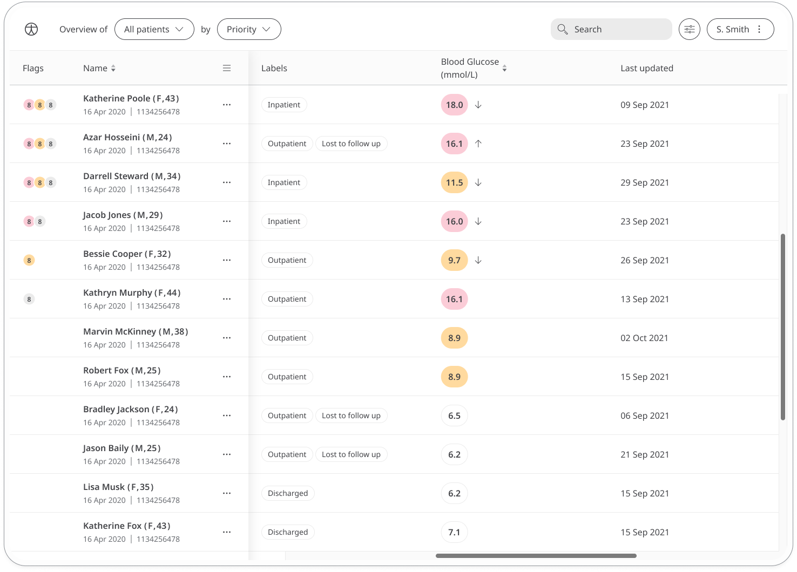

** Helping diabetics manage their condition. **

For people who suffer from, or susceptible to, High blood sugar (hyperglycaemia) are at risk of life-threatening complications and damage to parts of the body such as the eyes, kidneys and blood vessels. The Blood Glucose Module in Huma will record the values obtained via a Blood Glucose Monitor so Care Teams can assess whether you are in the normal range of 3.9-7.2 mmol/L.

## How it works

Patients will measure their blood glucose using a Blood Glucose Monitor, and enter into the Huma App. From there, Clinicians can view new and historic results in the Clinician Portal and be informed on severity.  

### Patients

From the home screen, Patients can select the Blood Glucose Modules, and simply by clicking “Add” a result can be entered in mmol/L (millimoles per litre) with the time and date automatically added as now, but editable. 

From within the module, Patients can view their progress in a graph and press “Show all data” to view previous results in a table. Patients can also set a daily, weekly, or monthly reminder to help keep on track.

### Clinicians

In the Clinician Portal, on the [Patient List](/data-collection/features/navigation/portal/patient-list/)Clinicians can view a table of Patients, from which the Blood Glucose column will display the last recorded reading indicated as a [Red Amber Green](/data-collection/features/flags-and-rag/) indicator to inform severity. 

Clicking on the Patient row takes the Clinician to the Patient Summary where all vitals can be viewed, by selecting the Blood Glucose module all historic data can be displayed as a graph or a table of results.