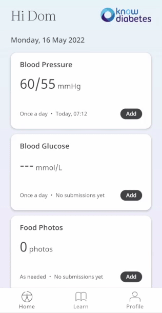

** Tracking Blood Pressure to lower risk. **

Maintaining a normal blood pressure, considered to be between 90/60mmHg and 120/80mmHg, is important to avoid risk of serious problems such as heart attacks and strokes. High blood pressure can go unnoticed and therefore Huma provides this module to record and track your result to help improve your health.

The Blood Pressure Module records values that will give your Care Team the data needed about our health which can be used for insights and inform your care.

## How it works

Patients can enter their blood pressure reading from a monitor which is expressed as 2 values:
- **Systolic**: the highest level your blood pressure reaches when your heart beats
- **Diastolic**: the lowest level your blood pressure reaches when your heart relaxes between beats

Both values are given in mmHg and the first has to be higher than the second.

### Patients

In the Huma App, Patient’s can select the Blood Pressure module and simply by clicking “Add” a result can be entered in mmHg (millimetres of mercury) with the time and date automatically added as now, but editable. 

From within the module, Patients can view their progress in a graph and press “Show all data” to view previous results in a table. Patients can also set a daily, weekly, or monthly reminder to help keep on track.

### Clinicians

In the Clinician Portal, on the [Patient List](/data-collection/features/navigation/portal/patient-list/) Clinicians can view a table of Patients, from which the Blood Pressure column will display the last recorded reading indicated as a [Red Amber Green](/data-collection/features/flags-and-rag/) indicator to inform severity. 

Clicking on the Patient row takes the Clinician to the Patient Summary where all vitals can be viewed, by selecting the Blood Pressure module all historic data can be displayed as a graph or a table of results.