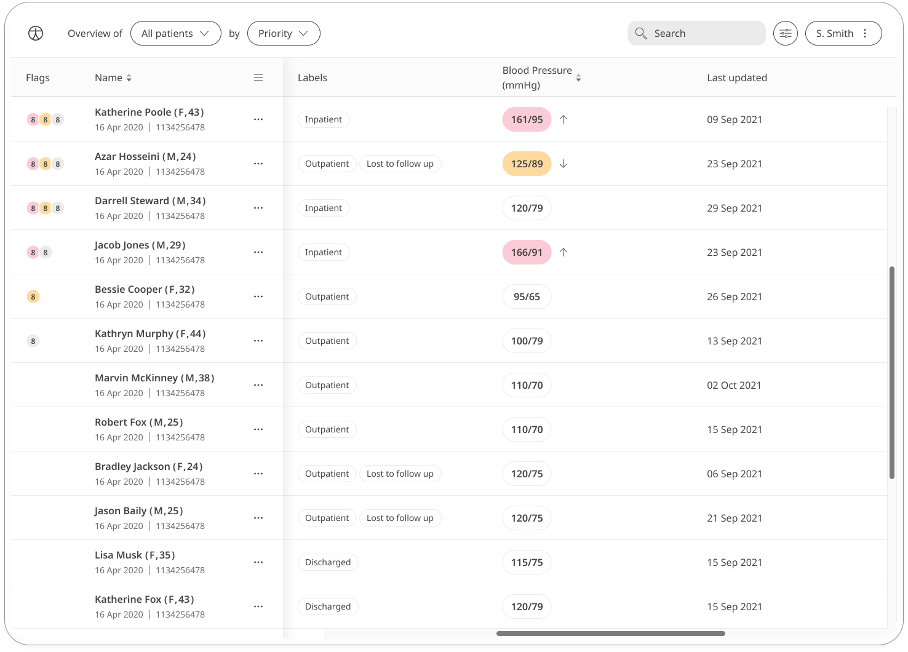

Maintaining normal blood pressure is important for a healthy heart and body. Untreated, high blood pressure can lead to health conditions. The Blood Pressure module helps patients and their care teams work together to keep their blood pressure within normal limits.

## How it works

Using a monitor to take their blood pressure, patients enter the two values into the Blood Pressure module in mmHg:
- **Systolic** - the highest level your blood pressure reaches when your heart beats
- **Diastolic** - the lowest level your blood pressure reaches when your heart relaxes between beats

The time and date is added automatically at the moment they make the entry (although this can be edited if needed). Patients can set reminders from within the module to help them stay on track and make sure they don't miss a reading.

Patients can view their historic blood pressure results in a graph. In the Clinician Portal, care teams will be able to easily see the latest blood pressure readings from their patients and any concerning readings will be flagged. 

The Patient Summary displays a more detailed view of the patient's historic readings in graph or table form, including both systolic and diastolic values.

