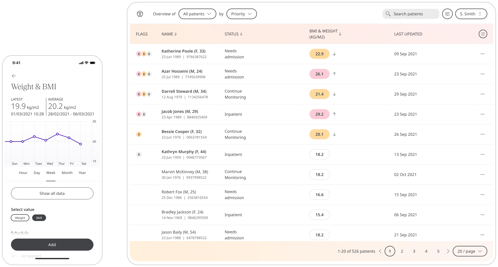

BMI is a measure of whether a Patient is a healthy weight for their height. Huma provides the functionailty to track BMI for themselves and provide to their Clinicians in order to determine any advice needed.

## How it works

In the sign up process, Patients are asked for their height and with that when they report their weight the BMI can be calculated. 

### Patients

In the Huma App, Patients can select the Weight & BMI module and by pressing the “Add” button can enter a value as kilograms (or configured unit), with the time and date automatically added as now, but editable. 

From within the module, Patients can view their progress in a graph, changing to view BMI by pressing the “BMI” button, and press “Show all data” to view previous results in a table. Patients can also set a daily, weekly, or monthly reminder to help keep on track.

### Clinicians

In the Clinician Portal, on the Patient List, Clinicians can view a table of Patients, from which the BMI & Weight column will display the last recorded reading indicated as a Red Amber Green indicator to inform severity. 

Clicking on the Patient row takes the Clinician to the Patient Summary where all vitals can be viewed, by selecting the Weight & BMI module all historic data can be displayed as a graph or a table of results.

