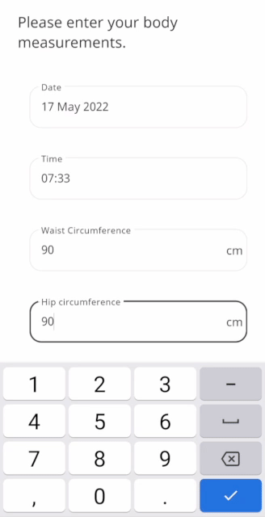

** Helping Patients make good lifestyle choices. **

The Body Measurement Modules in Huma aims to take basic yet important vitals for Care Teams to assess and advise of lifestyle changes and any healthcare actions to take.

## How it works

In the Huma app, Patients can select the Body Measurements module, and by pressing “Add” they can enter their waist and hip measurements in cm (centimetres).

