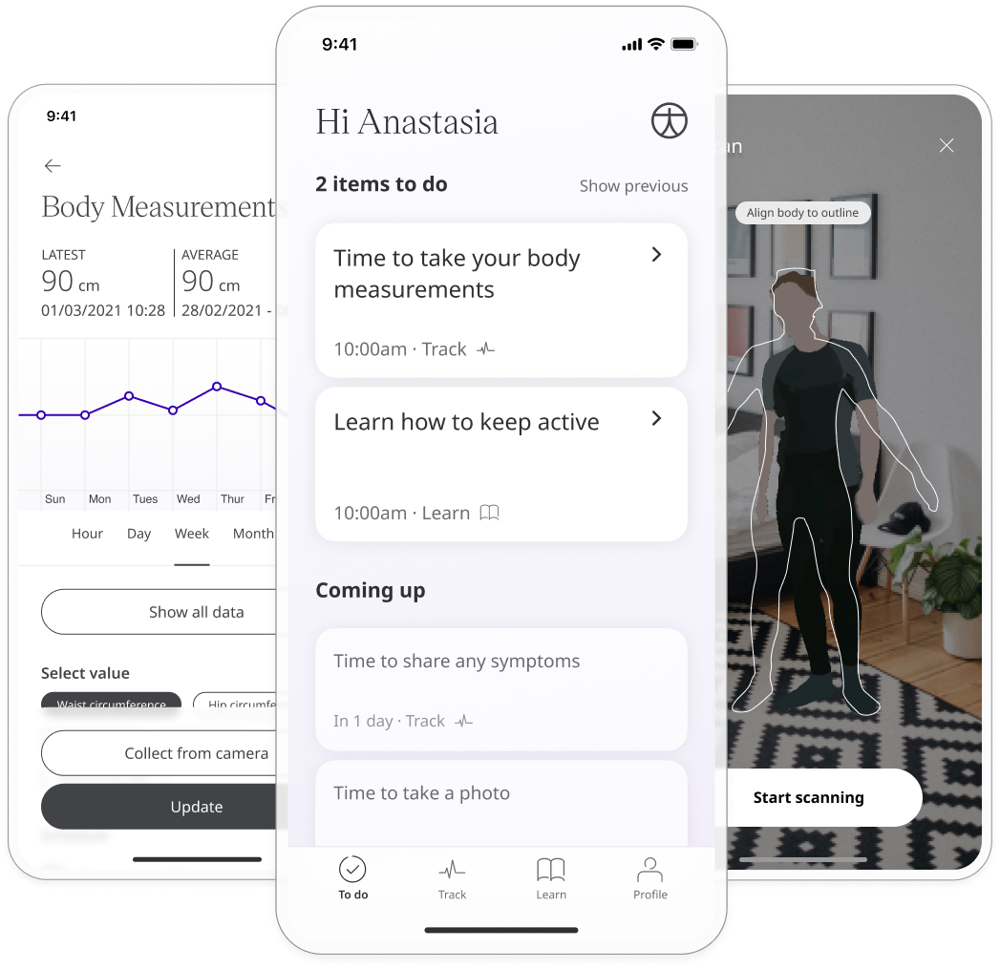

Body measurements can be used to calculate risk of weight-related and metabolic health problems. Waist and hip circumferance help determine the body fat content in a patient's midsection. From this data, a waist-to-hip ratio (WHR) is calculated to estimate the body fat content in the midsection. By using a ratio, WHR adjusts for different body shapes. Visceral fat measures the fat in and around the midsection, which plays an important part in protecting vital organs. Total body fat is a measure of how much of your body mass is made up of essential body fat and storage body fat. Too much or too little visceral fat or body fat can cause health problems. Both can be regulated through a balanced diet and regular exercise. 

## How it works

The patient uses a measuring tape to take measurements from different areas of their body and records them in the App. Other measurements are taken by scanning the body with the phone's camera. 

- **Waist circumference** - This measurement should be taken using a measuring tape just above the belly button. The tape should be snug but not tight and the measurement should be taken on an outward breath.
- **Hip circumference** - This measurement should be taken using a measuring tape around the widest part of the hips and buttocks. 
- **Waist to Hip ratio** - This is calculated automatically from Hip and Waist circumference.
- **Visceral fat** - This measurement is collected by scanning the body using the camera on the Patient’s phone.
- **Total body fat %** - A balanced diet and regular exercise can help maintain the optimum level. This measurement is collected by scanning the body using the camera on the Patient’s phone.

The Huma App uses Profile data such as height, weight, age and gender collected from the patient in the onboarding process to make some of these calculations. Patients can then enter their waist and hip measurements and scan themselves to determine visceral and total body fat percentage and add this data to the module.

This module helps patients to understand their health and the data collected is not viewable to care teams in the Clinician Portal. 
