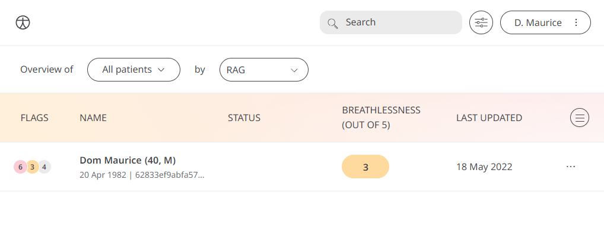

** Assessing the quality of your breathing. **

Shortness of breath has common causes such as asthma, chest infection, smoking, etc. But can also be a sign of something more serious. Therefore Huma provides a quick assessment to understand the degree of breathlessness Patients are experiencing. The information Patients provide will allow Care Teams to track lung function over time and provide any insight or advice on any steps to be taken. 

## How it works

In the Huma App, Patients can select the Breathlessness module and answer the question “How breathless are you when you are walking around or walking up stairs?” with the following options:
- None
- Mild
- Moderate
- Severe
- Very Severe

To view historic answers, Patients can see a table of them by pressing “Previous entries”.

### Clinicians

In the Clinician Portal, on the Patient List, Clinicians can view a table of Patients, from which the Breathlessness column will display the last recorded reading indicated as a Red Amber Green indicator to inform severity. 

Clicking on the Patient row takes the Clinician to the Patient Summary where all vitals can be viewed, by selecting the Breathlessness module all historic data can be displayed as a graph or a table of results.

