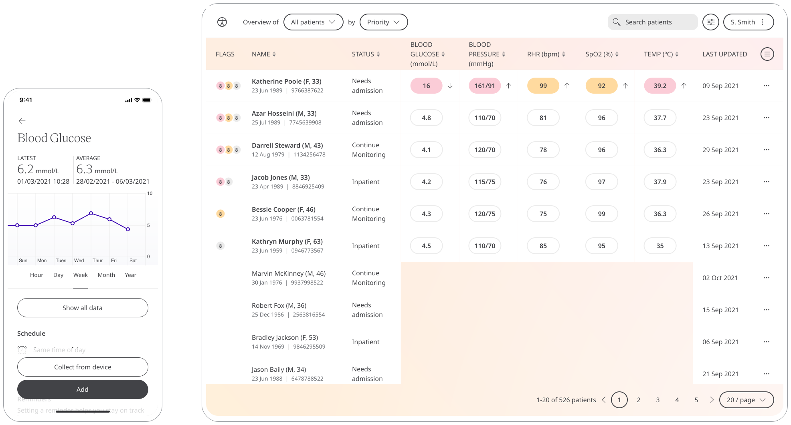

** Taking a closer look at the heart. **

An ECG is often used alongside other tests to help diagnose and monitor conditions affecting the heart. The ECG module records the data for a Patient's heart rhythm and electrical activity to look for irregularities.

Huma can record patient ECG data from the AliveCor devices.

## How it works

Patients will log into Kardia account from the ECG AliveCore module in the Huma App. This will sync the ECG data provided in the Clinician Portal for Care Teams to assess.

### Patients
 
From the home screen, Patients can select the ECG AliveCore module. From here, "Sync device" can be chosen, and by following the steps can connect their Kardia account.

<!--  -->

From within the module, Patients can view their historical Data.

### Clinicians

In the Clinician Portal, on the Patient List, Clinicians can view a table of Patients. The ECG Monitoring - AliveCor column will display the last recorded reading indicated as a Red Amber Green indicator to inform severity. 

<!--  -->

Clicking on the Patient row takes the Clinician to the Patient Summary, where Care Teams can view all vitals. By selecting the ECG Monitoring - AliveCor all historical data can be displayed as a graph or a table of results.