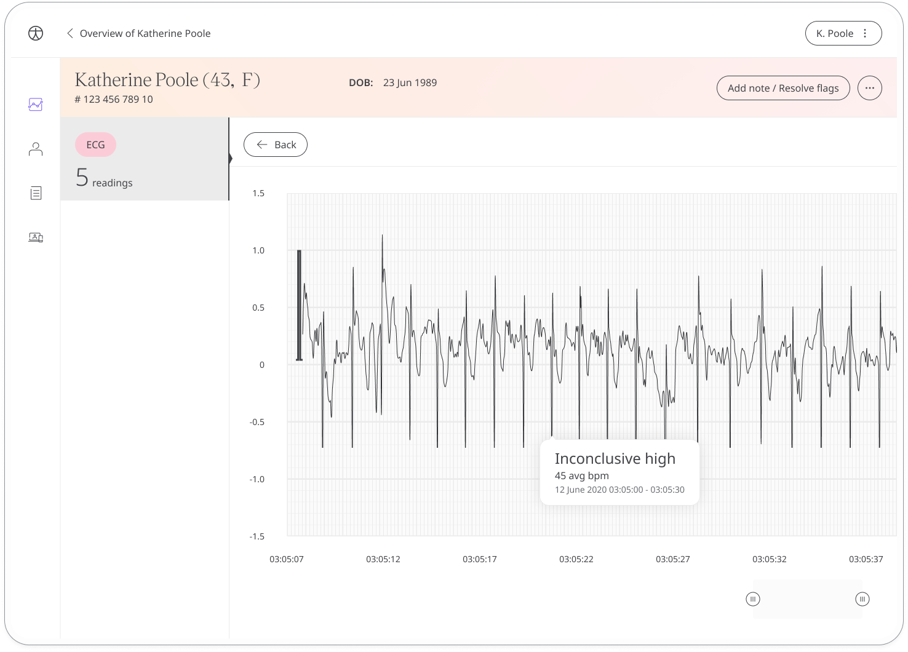

** Taking a closer look at the heart. **

An ECG is often used alongside other tests to help diagnose and monitor conditions affecting the heart. The ECG module records the data for a Patient's heart rhythm and electrical activity for the means of looking for irregularities.

This feature is available to iPhone Patients on iOS 14 or later, with Apple Watch Series 4 or later only.

## How it works
This module provides the ability for iOS user patients to sync their ECG data collected from apple watch with Huma App and Clinician Portal. By selecting the ECG module, the Patient can tap on Sync to manually retrieve the data from their Apple Watch. 

From within the module, Patients can view their progress in a graph and press “View previous entries” to view previous results in a table. Patients can also set a daily, weekly, or monthly reminder to help keep on track.

### Clinicians

In the Clinician Portal, on the Patient List, Clinicians can view a table of Patients, from which the ECG column will display the last recorded reading as one of the following results:

- Sinus rhythm
- Atrial fibrillation
- Inconclusive high heart rate
- Inconclusive low heart rate
- Undetermined

With that it will be indicated as a Red Amber Green indicator to inform severity. 

Clicking on the Patient row takes the Clinician to the Patient Summary where all vitals can be viewed, By selecting the ECG module all historic data can be displayed as a graph or a table of results.

