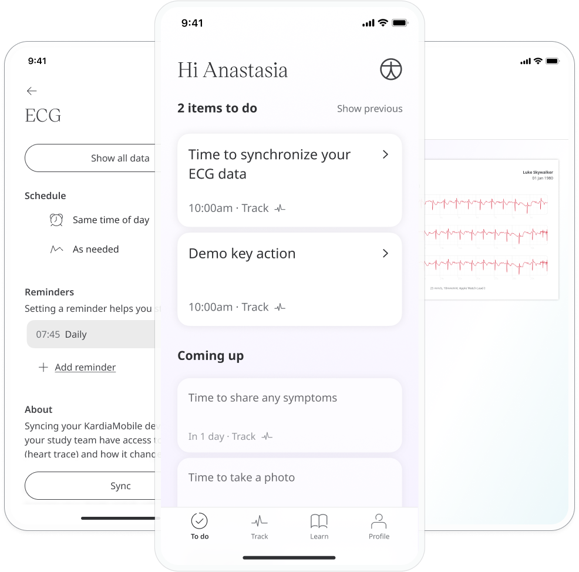
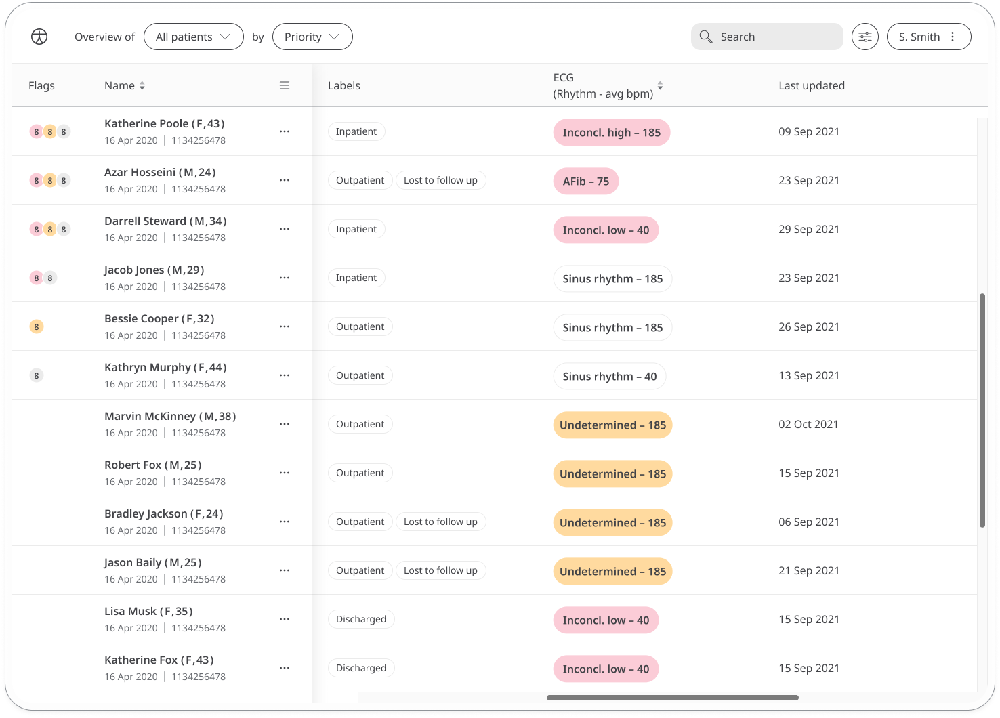

An ECG is often used alongside other tests to help diagnose and monitor conditions affecting the heart. The ECG module records the patient's heart rhythm and electrical activity to look for irregularities.

## How it works

This feature is available to sync with ECG devices. Patients open the module and tap on **Sync** to retrieve the data from their device and sync it with the Huma App.

Patients can view their historic ECG results in a graph. In the Huma Portal, care teams will be able to easily see the results of the latest ECG readings. 

Results check for normal, abnormal or inconclusive results including, but not limited to:
- Sinus rhythm
- Atrial fibrillation
- Inconclusive high heart rate
- Inconclusive low heart rate
- Undetermined 

The Patient Summary displays a more detailed view of the patient's historic readings in graph or table form.

