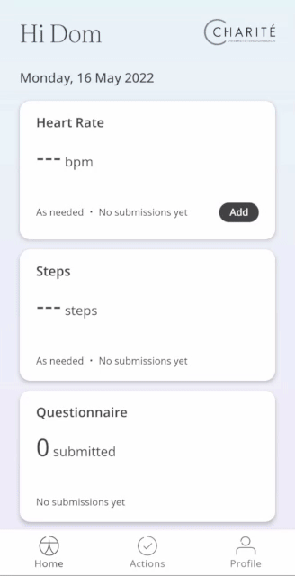
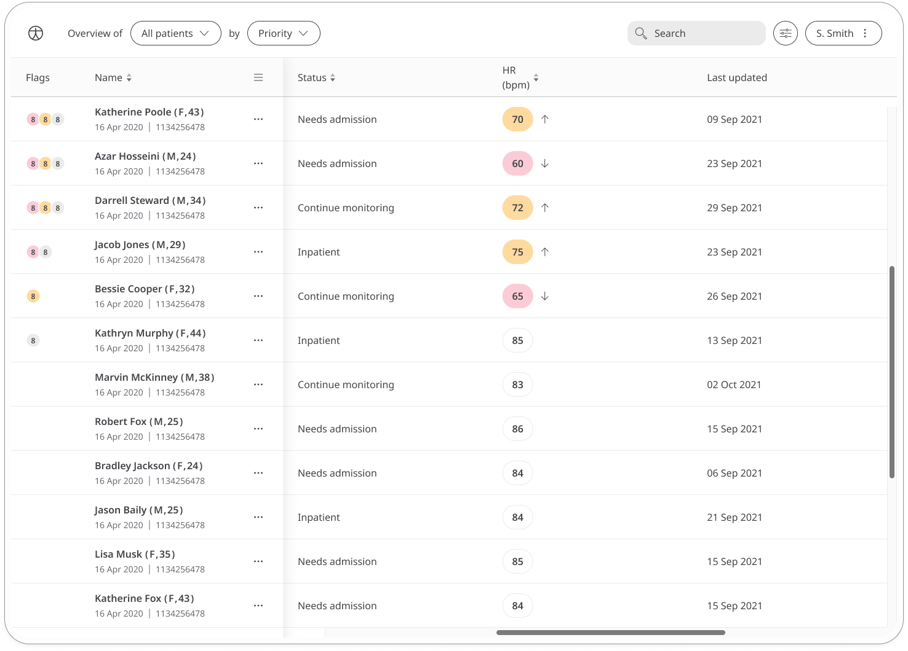

** Tracking the track heart to identify irregularities **

The Heart Rate module is used to record how many times a Patient’s heart beats in a minute. The normal value is between 60 and 100 bpm, but can be affected by certain heart conditions, stress, anxiety, etc.

Recording this information is an easy and effective way for a Care Team to gauge a Patient’s health.

## How it works

Patients can measure their Heart Rate using a fitness tracker, smartphone with relevant functionality, smart watch, or counting the pulse in the wrist in one minute. From there, Clinicians can view new and historic results in the Clinician Portal and be informed on severity.  

### Patients

In the Huma App, Patients can select the Heart Rate module and by pressing the “Add” button can enter a value in bpm (beats per minute) with the time and date automatically added as now, but editable. 

From within the module, Patients can view their progress in a graph and press “Show all data” to view previous results in a table. Patients can also set a daily, weekly, or monthly reminder to help keep on track.

### Clinicians
In the Clinician Portal, on the Patient List, Clinicians can view a table of Patients, from which the Heart Rate column will display the last recorded reading indicated as a Red Amber Green indicator to inform severity. 

Clicking on the Patient row takes the Clinician to the Patient Summary where all vitals can be viewed, by selecting the Heart Rate module all historic data can be displayed as a graph or a table of results.