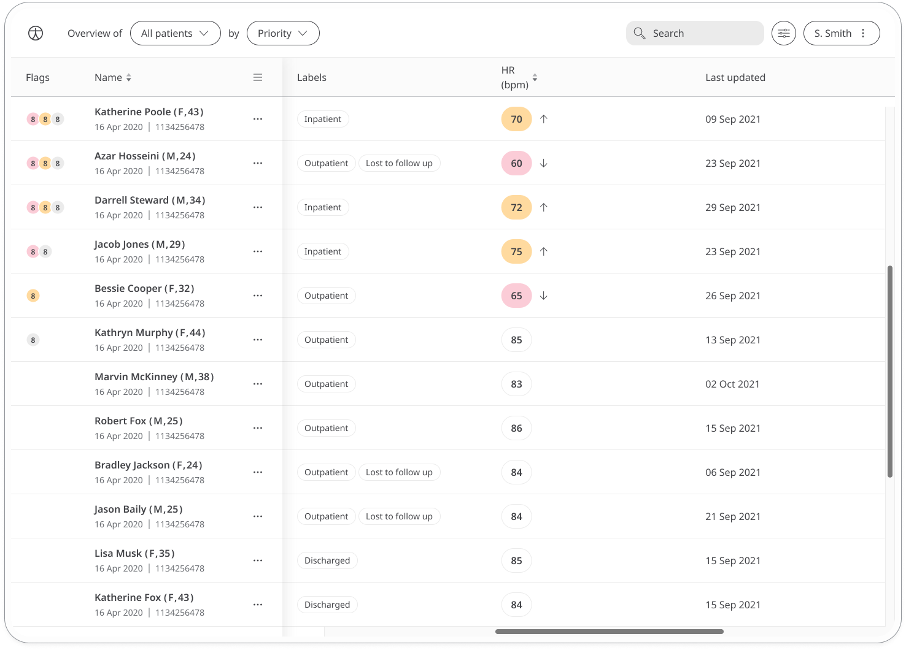

Depending on which source of data the readings come from, the Heart Rate module can be used to collect heart rate, heart rate variability and classification. For heart rate, the module records how many times a patient’s heart beats per minute. A healthy heart rate is between 60 and 100 bpm but can be affected by certain heart conditions, stress, anxiety, etc. 

Heart rate variability measures the difference between your individual heartbeats. These fluctuations are undetectable without a specialised device, but can indicate current or future health problems, including heart conditions and mental health issues like anxiety and depression.

Classification is the outcome of the heartbeat rhythm. Huma provides 2 possible heart rate classification outcomes using Happitech's medical grade, class IIa CE-certified SDK - atrial fibrillation and normal sinus rhythm.

## How it works

Patients have a number of ways in which to collect their heart rate reading:

- connecting the Huma Care App to Apple Health or Google Fit
- taking the reading manually  
- using their smartphone camera to take the reading

Using the smartphone camera collection method also gives the user a heart rate variability and classification reading. When configuring the module, the Admin can select which readings and sources should be available (maximum 2 sources per deployment). For example, deployments can choose to only have the heart rate reading from the smartphone camera source, instead of heart rate, heart rate variability and classification.

The time and date is added automatically at the moment they make the entry (although this can be edited if needed). 

Patients can view their historic readings in a graph. In the Care Portal, care teams will be able to easily see the latest readings from their patients and any concerning readings will be flagged.  

The Patient Summary displays a more detailed view of the patient's historic readings in graph or table form.

