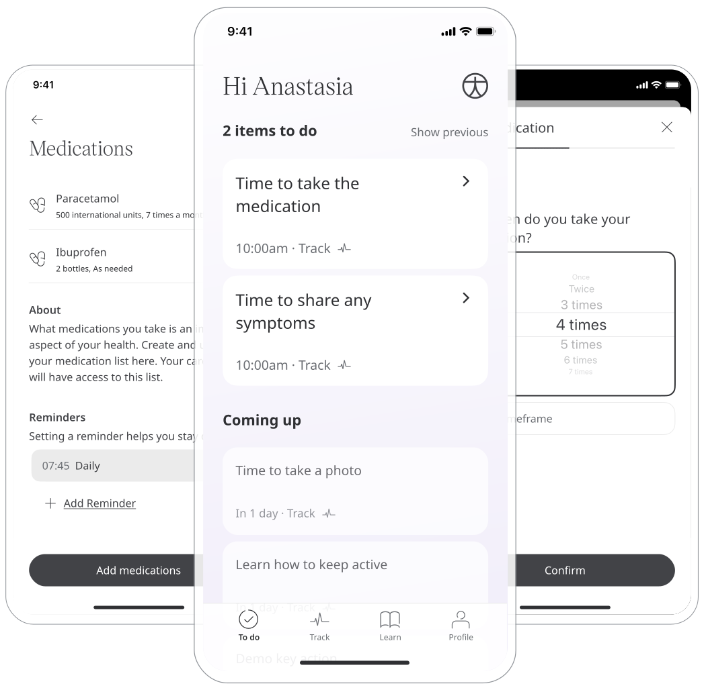
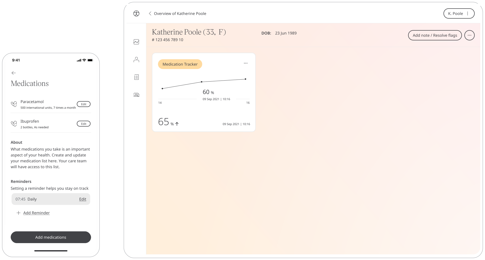
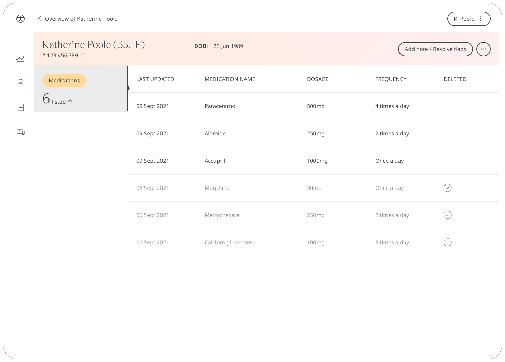

** Informing Care Team with Patients’ medication **

Huma provides a means to health care alongside a Patients current health care. With that, they may well have medications they currently take and that will have to be stated to their Care Team. The Medication Tracker module allows Patients to make a log of ongoing medicine and how much they adhere to it, in order to fully inform Clinicians when they are providing feedback or making Health Care decisions.

## How it works

### Patients

The Medication Tracker will bring the list of all items from the Medications Module. 

In the Huma App, Patients can select the Medication Tracker module and simply by clicking “Take Adherence Questionnaire” are able to report how much commitment they have taken to all their medication, out of 100, and how they have responded to it.

From within the module, Patients can view their progress in a graph and press “Show all data” to view previous results in a table. Patients can also set a daily, weekly, or monthly reminder to help keep on track.

In addition, Patients can add additional medication in the same way as the Medications Module.

### Clinicians

In the Clinician Portal, on the Patient Summary, Clinicians can view all data submitted, from which the Medication Tracker module will show the historic entries from the Patient.

By clicking on the module, all historic data can be displayed as a graph or a table of results.

