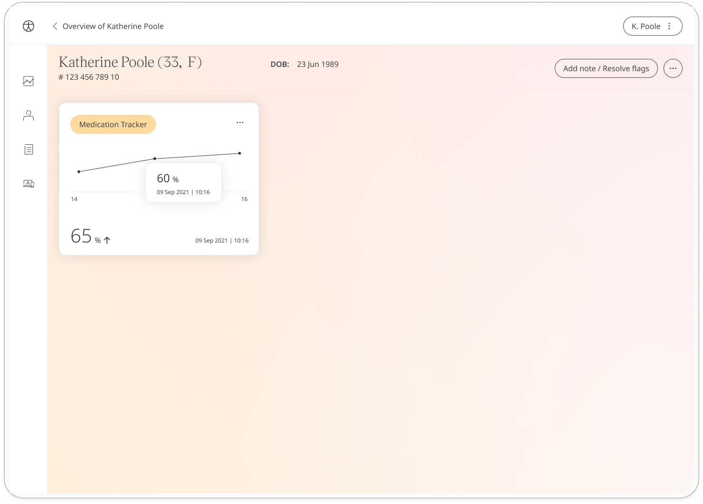
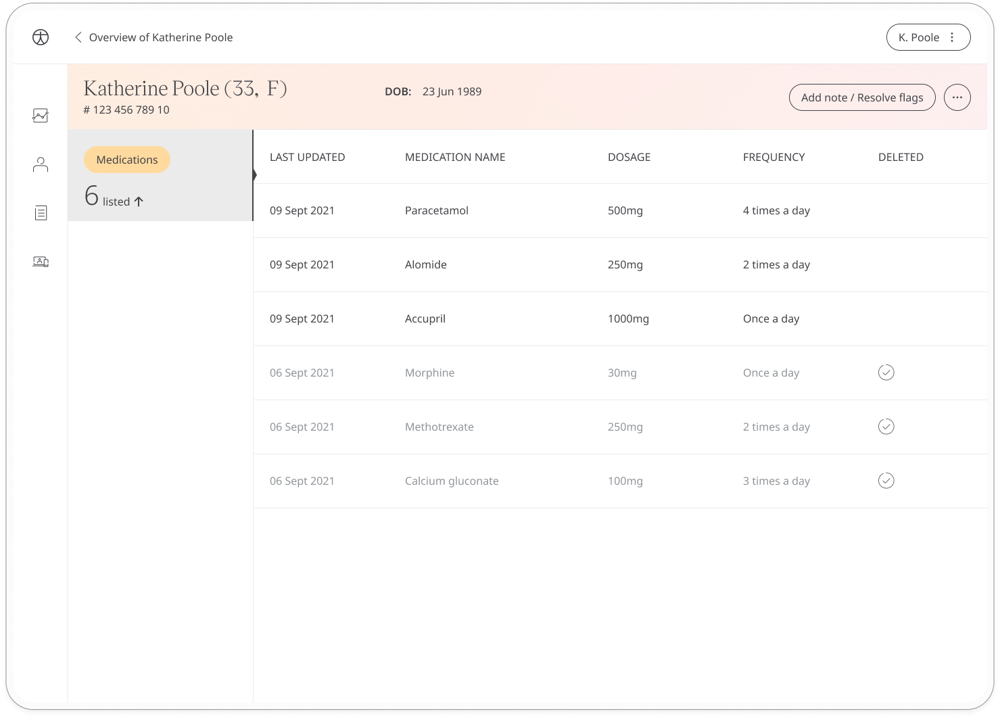

Patients may be taking medications associated to another care plan that should be shared with their care team. The Medication Tracker module allows patients to make a log of medications and track how they are responding.

## How it works

The Medication Tracker presents patients with an adherence questionnaire which asks them to what extent they have stuck to their medication plan and how they have responded to it. The tracker also pulls data from the [Medication module]() although patients can also add their medication in this module. 

The time and date is added automatically at the moment they make the entry (although this can be edited if needed). Patients can also set reminders from within the module to help them stay on track.

Patients can view their historic data fom the module. In the Clinician Portal, care teams will be able to see the patient's latest entries and any concerning readings will be flagged. 

The Patient Summary displays a more detailed view of the patient's historic data in graph or table form.

