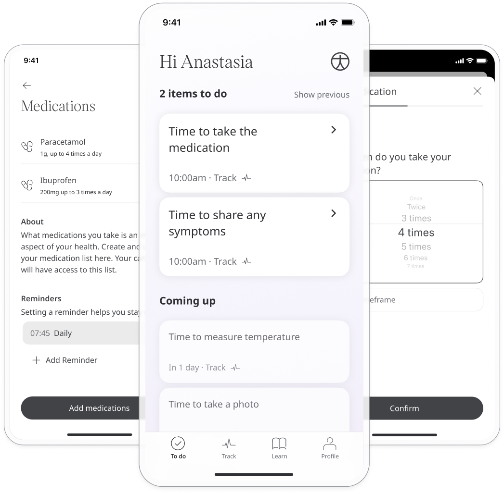
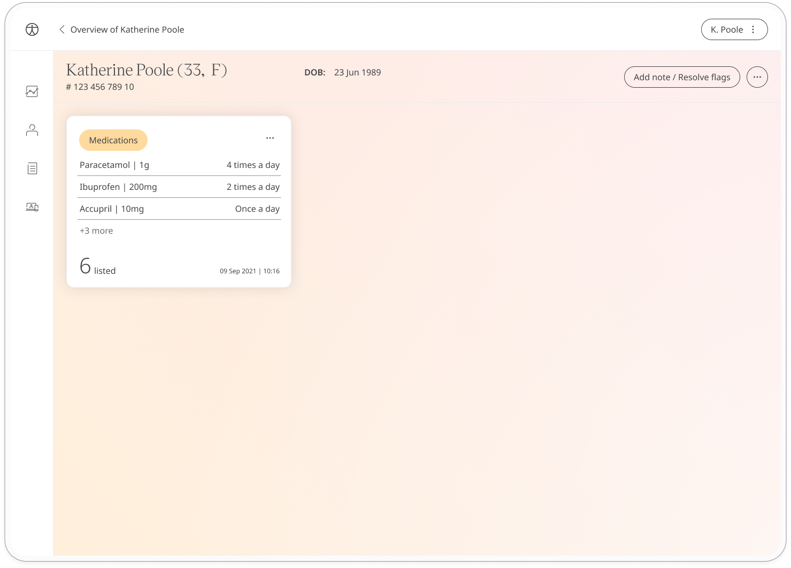

** Informing Care Team with Patients’ medication **

Huma provides a means to health care alongside a Patient's current health care. With that, they may well have medications they currently take and that will have to be stated to their Care Team. The Medications module allows Patients to make a log of ongoing medicine in order to fully inform Clinicians when they are providing feedback or making Health Care decisions.

## How it works

### Patients

In the Huma App, Patients can select the Medications module and simply by clicking “Add medication” medication can be added with additional information.

From within the module, Patients can view their Medications added, as well as change or delete them as necessary. This can be used in conjunction with the Medication Tracker module.

### Clinicians

In the Clinician Portal, on the Patient Summary, Clinicians can view all data submitted, from which the Medication module will show the historic entries from the Patient.

By clicking on the module, all historic data can be displayed as a graph or a table of results.

