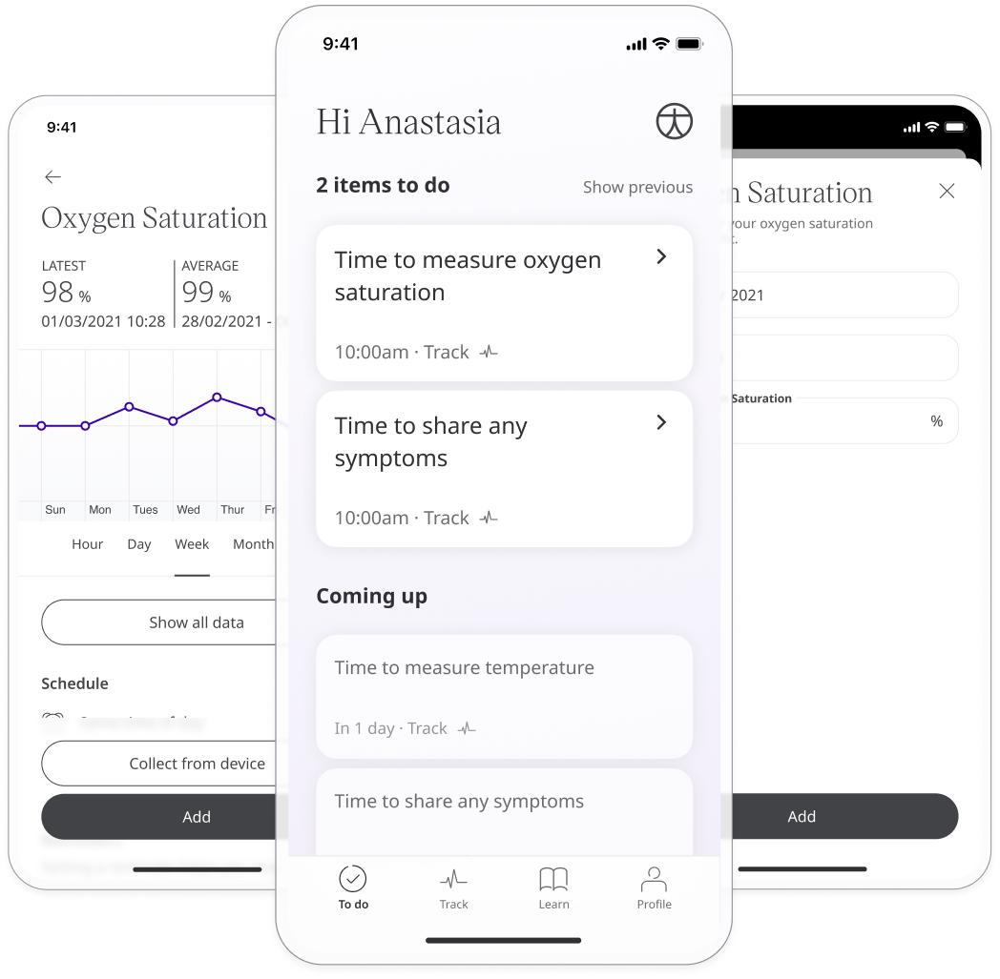
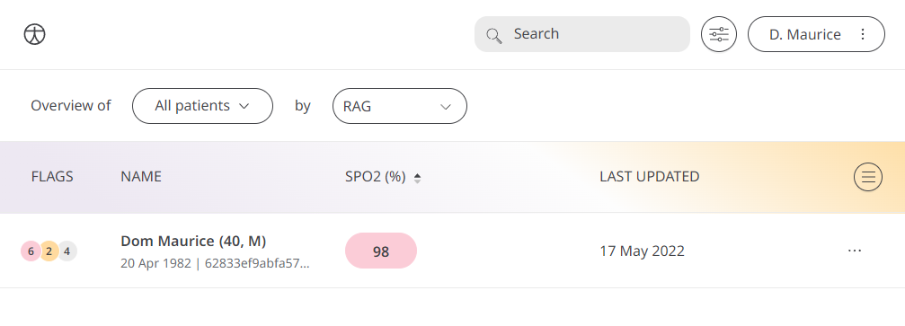
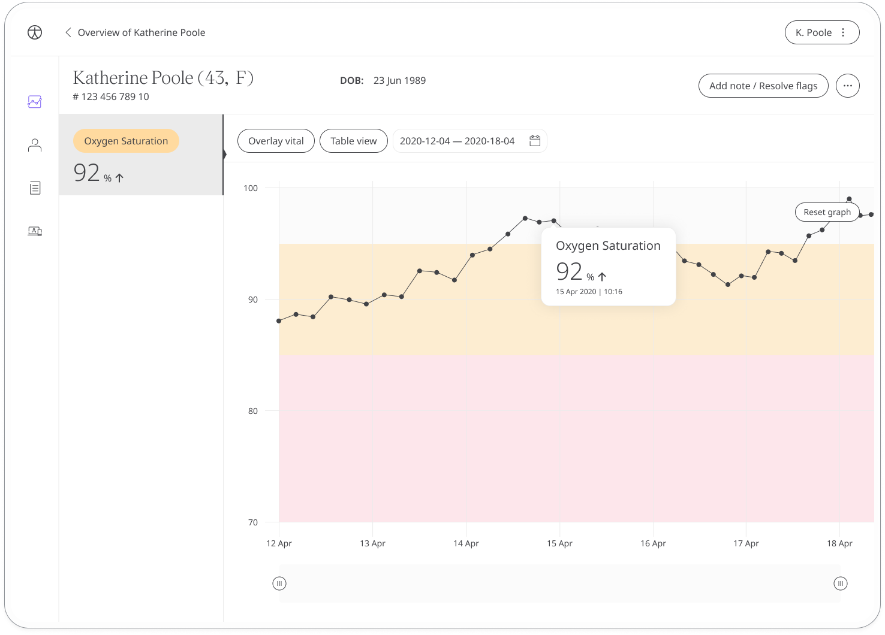

** Ensuring the body’s organs are getting oxygen to function properly **

The patient’s blood oxygen level is the measurement of the percentage of oxygen in the blood. The Oxygen Saturation module allows Patients to monitor their blood oxygen level and is made available to Care Teams so that they can assess that the body is functioning properly.

## How it works

Patients will measure their Oxygen Saturation using a Pulse Oximeter, and enter into the Huma App. From there, Clinicians can view new and historic results in the Clinician Portal and be informed on severity.  

### Patients

In the Huma App, Patients can select the Oxygen Saturation module and by pressing the “Add” button can enter a value as a percentage with the time and date automatically added as now, but editable. 

From within the module, Patients can view their progress in a graph and press “Show all data” to view previous results in a table. Patients can also set a daily, weekly, or monthly reminder to help keep on track.

### Clinicians

In the Clinician Portal, on the Patient List, Clinicians can view a table of Patients, from which the SPO2 column will display the last recorded reading indicated as a Red Amber Green indicator to inform severity. 

Clicking on the Patient row takes the Clinician to the Patient Summary where all vitals can be viewed, by selecting the Oxygen Saturation module all historic data can be displayed as a graph or a table of results.

