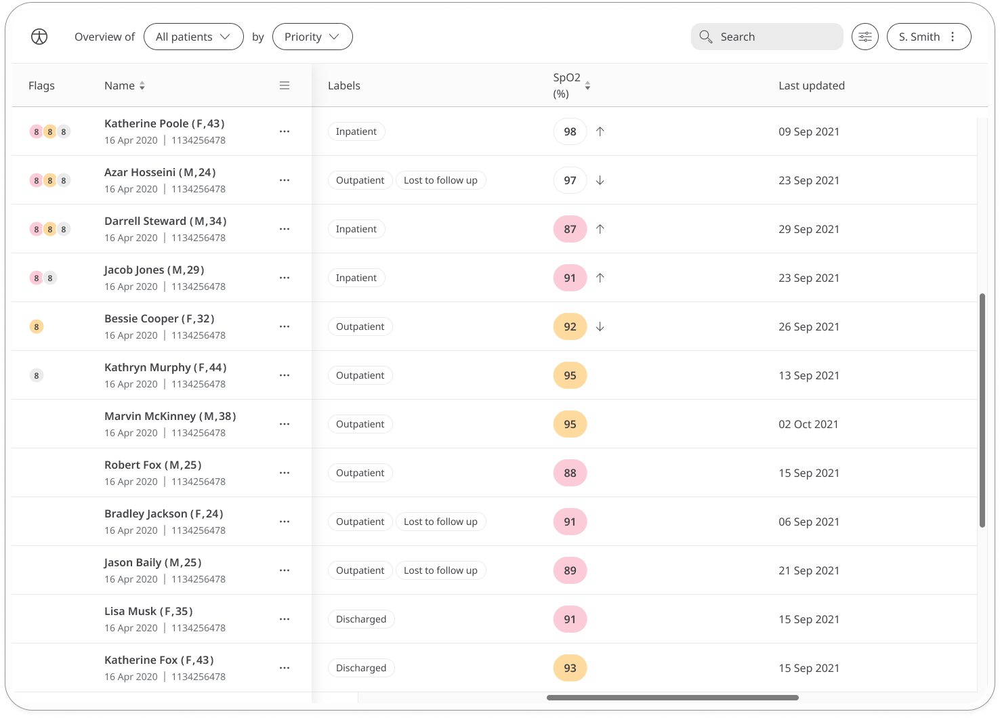

** Ensuring the body’s organ are getting oxygen to function properly **

The patient’s blood oxygen level is the measurement of the percentage of oxygen in the blood. A normal level is typically between 95-100%. Individuals with a resting stable oxygen saturation of 92% or less should be referred for a blood gas assessment to see if oxygen therapy is appropriate, as per BLF Guidance. If the oxygen level is 92% or below emergency services are to be contacted immediately.

## How it works

Patients will measure their Oxygen Saturation using a Pulse Oximeter, and enter into the Huma App. From there, Clinicians can view new and historic results in the Clinician Portal and be informed on severity.  

### Patients

In the Huma App, Patients can select the Oxygen Saturation module and by pressing the “Add” button can enter a value as a percentage with the time and date automatically added as now, but editable. 

From within the module, Patients can view their progress in a graph and press “Show all data” to view previous results in a table. Patients can also set a daily, weekly, or monthly reminder to help keep on track.

### Clinicians

In the Clinician Portal, on the [Patient List](/data-collection/features/navigation/portal/patient-list/) Clinicians can view a table of Patients, from which the SPO2 column will display the last recorded reading indicated as a [Red Amber Green](/data-collection/features/flags-and-rag/) indicator to inform severity. 

