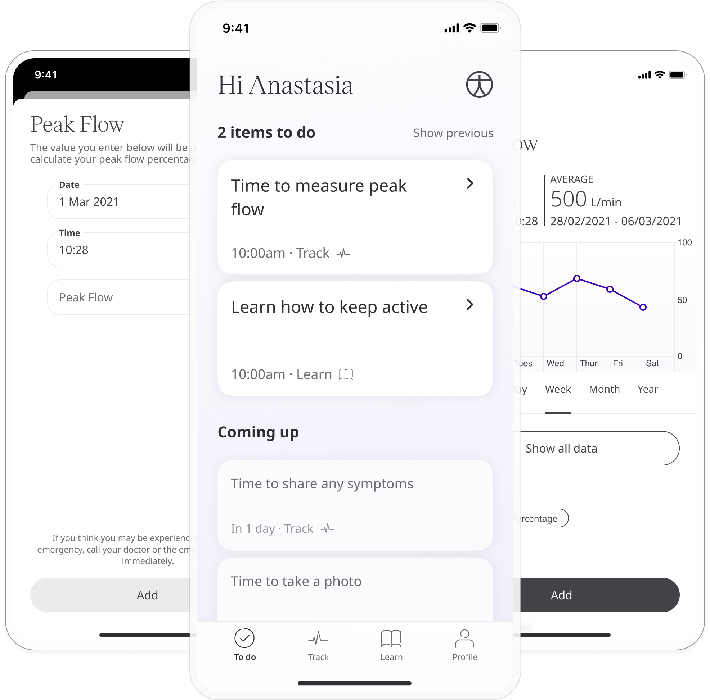
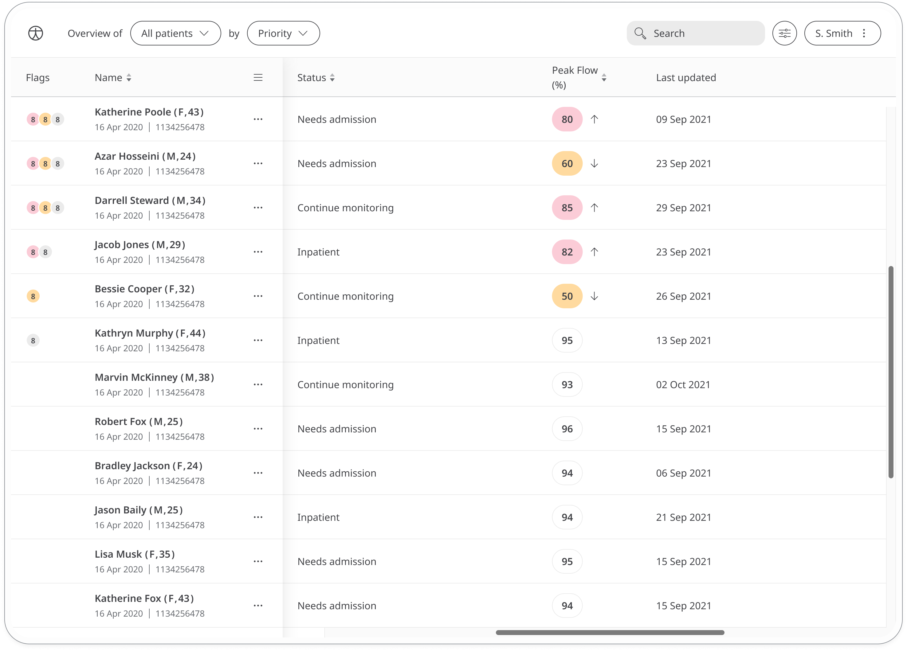
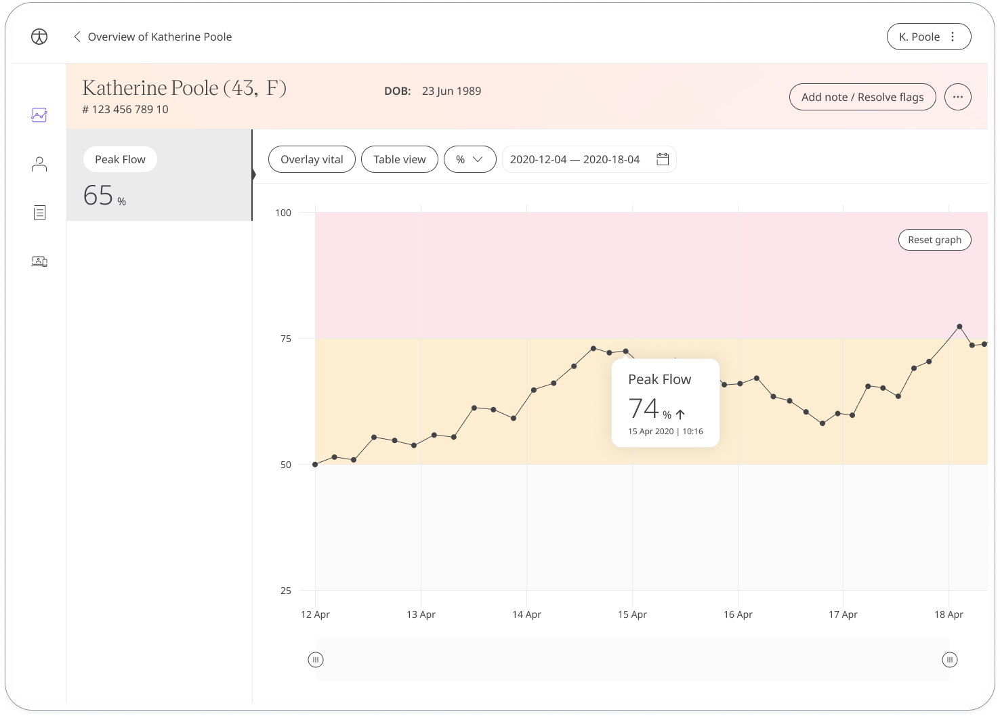

Peak flow is a measurement of how quickly you can blow air out for your lungs and is used to assess whether airways are narrowed from respiratory conditions such as asthma. With the Peak Flow module, patients can monitor their condition and care teams can track for any decline or improvement.

## How it works

Patients take readings using a peak flow meter and enter it into the Huma App. The peak flow result automatically takes into account gender, age and height (taken from the patient profile) and is displayed as a percentage.

The time and date is added automatically at the moment they make the entry (although this can be edited if needed) and patients can view their past entries from within the module. Reminders can also be set to help patients stay on track and make sure they don't miss a reading.

In the Clinician Portal, care teams will be able to easily see the latest peak flow entries from their patients and any concerning readings will be flagged. 

The Patient Summary displays a more detailed view of the patient's historic readings in graph or table form.

