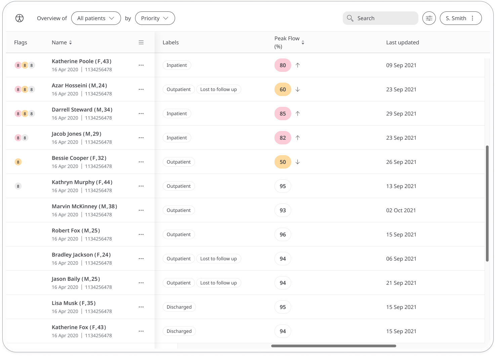

** Helping diagnose and monitor asthma **

Peak flow is a measurement of how quickly you can blow air out for your lungs, and is used to assess whether airways are narrowed from respiratory conditions such as asthma. With the Peak Flow module, Patients can monitor their conditions and Care Teams can track for any decline or improvement for medical advice.

## How it works

Patients will measure their Peak Flow using a Peak Flow meter, and enter into the Huma App. From there, Clinicians can view new and historic results in the Clinician Portal and be informed on severity. 

### Patients

In the Huma App, Patients can select the Peak Flow module and by pressing the “Add” button can enter a value as L/min (litres per minute), with the time and date automatically added as now, but editable. The peak flow result will take into account your gender, age and height before showing your calculated result as a percentage

From within the module, Patients can view their progress in a graph and press “Show all data” to view previous results in a table. Patients can also set a daily, weekly, or monthly reminder to help keep on track.

### Clinicians

In the Clinician Portal, on the Patient List, Clinicians can view a table of Patients, from which the Peak Flow column will display the last recorded reading indicated as a Red Amber Green indicator to inform severity.

Clicking on the Patient row takes the Clinician to the Patient Summary where all vitals can be viewed, by selecting the Peak Flow module all historic data can be displayed as a graph or a table of results.

