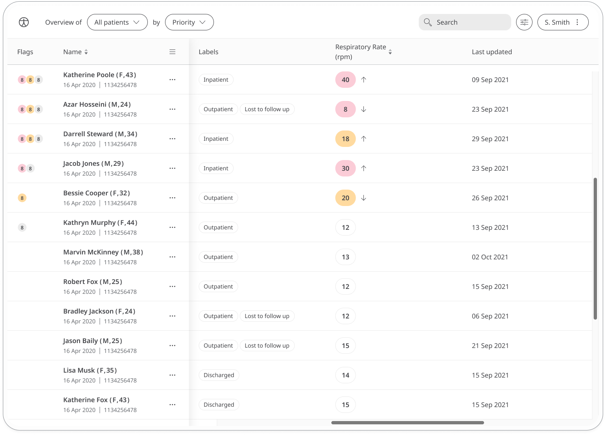

A Patient’s Respiratory Rate is a vital measurement that can be used to help in the health care for conditions. This simple measurement can be recorded in the Respiratory Rate module and used with Care Teams to ensure the best advice is given for the health care of the Patient.

## How it works

### Patients
In the Huma App, Patients can select the Respiratory Rate modules and enter a number of breaths taken in the course of one minute. Measuring is best taken whilst sitting and can be counted for the number of times the chest or abdomen rises.

From within the module, Patients can view their progress in a graph and press “Show all data” to view previous results in a table. Patients can also set a daily, weekly, or monthly reminder to help keep on track.

### Clinician

In the Clinician Portal, on the Patient List, Clinicians can view a table of Patients, from which the Respiratory Rate column will display the last recorded reading indicated as a Red Amber Green indicator to inform severity. 

Clicking on the Patient row takes the Clinician to the Patient Summary where all vitals can be viewed, by selecting the Respiratory Rate module all historic data can be displayed as a graph or a table of results.