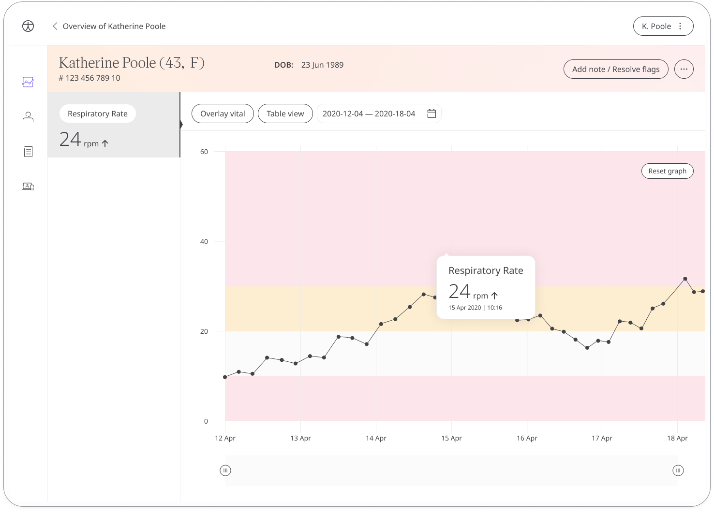

Respiratory rate measures the number of breaths per minute and is a vital measurement that can be used to help assess the risk of various health conditions. 

## How it works

Patients count the number of breaths they take over the course of a minute and enter this value into the module. Measurement is best taken whilst sitting and the recommended method is observing the rising of the chest or abdomen.

The time and date is added automatically at the moment they make the entry (although this can be edited if needed) and patients will also be able to view all their historic results from within the module. Reminders can be set to help them stay on track and make sure they don't miss an entry.

In the Huma Portal, care teams will be able to easily see the latest respiratory rate from their patients and any concerning readings will be flagged.  

The Patient Summary displays a more detailed view of the patient's historic readings in graph or table form.

