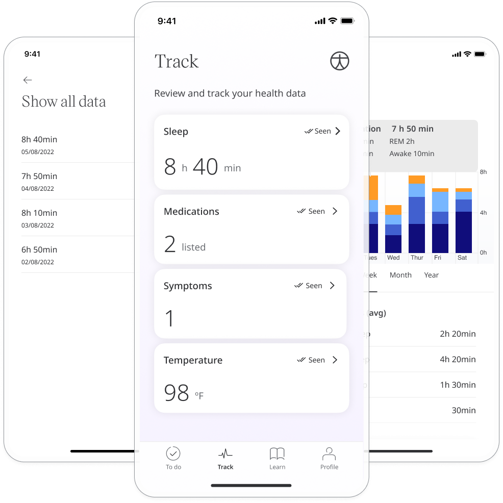
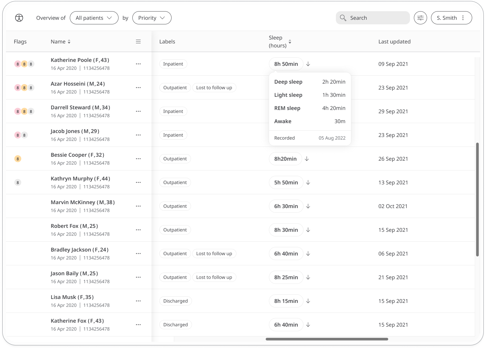
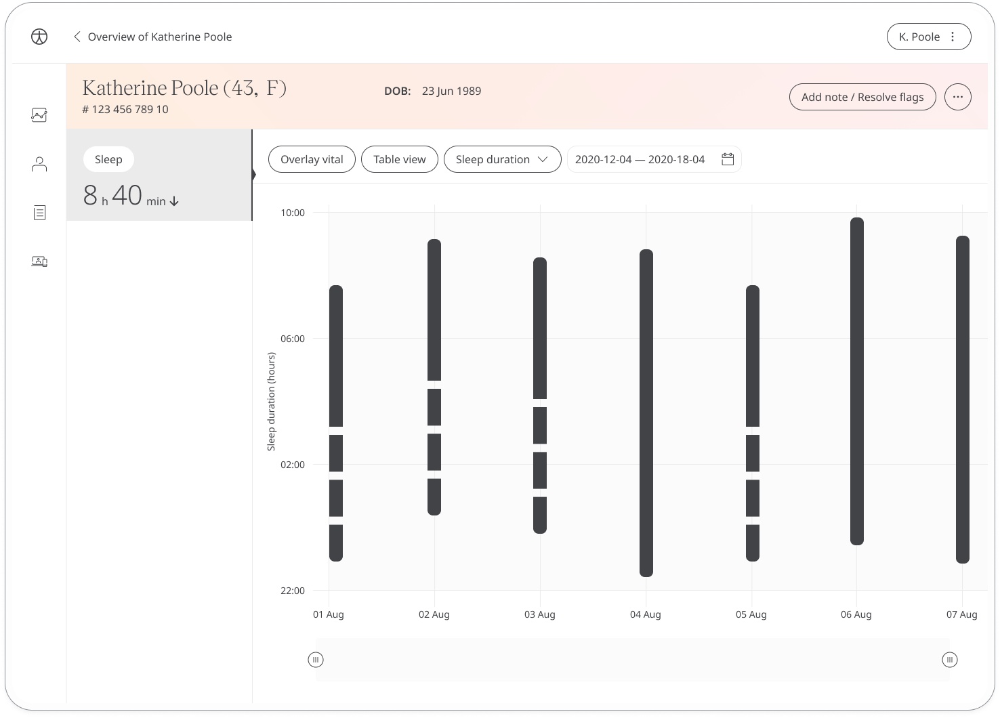

The sleep module helps to track different aspects of sleep such as sleep stages, length and how a patient feels about their sleep.

## How it works

This module syncs data from Fitbit. From the **Track** screen, open the Sleep module to automatically retrieve data from Fitbit and sync it with the Huma App.

In the clinician portal, care teams can view an overview of patient sleep data. Hovering over the data opens a more detailed view.

The Patient Summary displays a more detailed view of the patient's historic readings in graph or table form.

