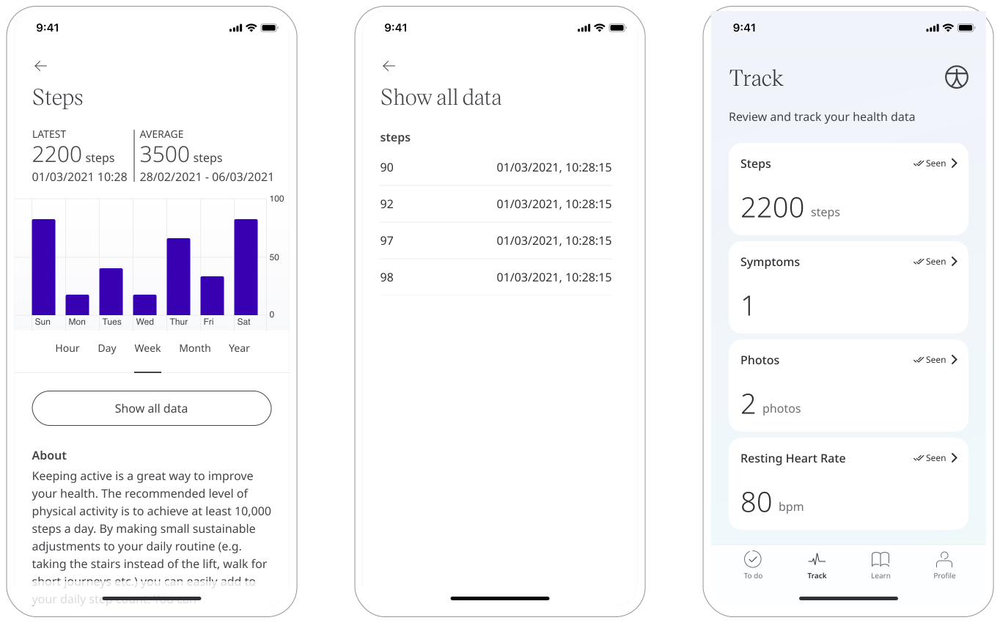
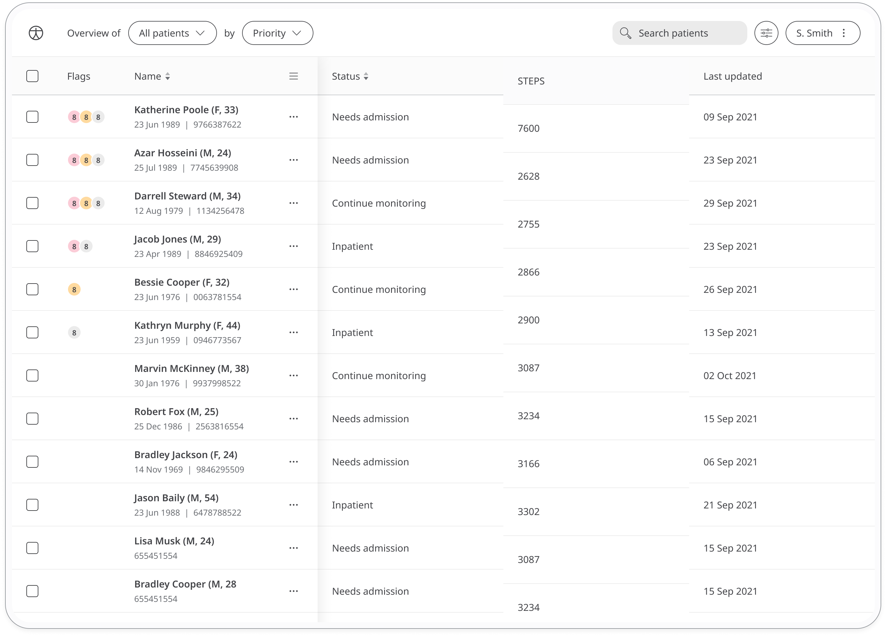

Physical exercise is a good measure of a patient's health. Walking helps patients retain a certain level of physical fitness, even if their sickness or health condition prevents them from more intense forms of exercise.

## How it works

Huma accesses the patient's step count from their fitness tracker, either Apple Health or Google Fit, and presents the data to their care team via the Steps module.

Patients first need to sync the App with Google Fit or Apple Health, followig the instructions in the Steps module. The data will automatically be populated in the Huma App.

Patients can view their steps data in a graph and care teams can view also see it from the Clinician Portal.

