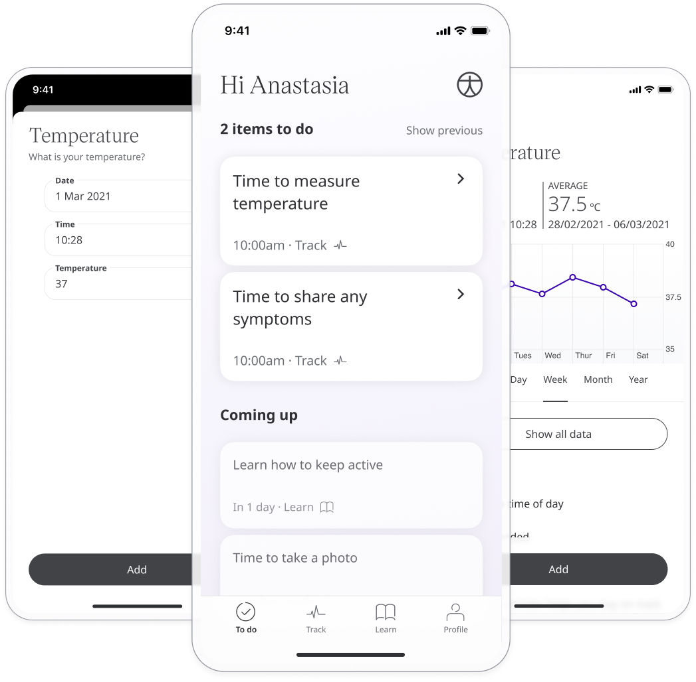
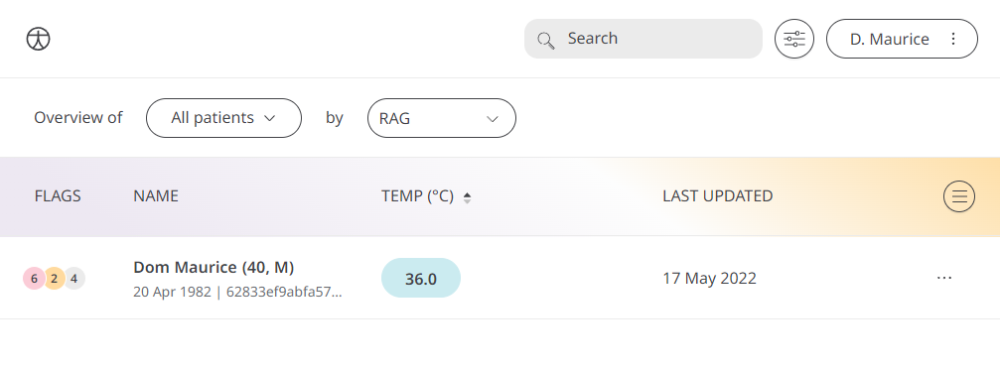
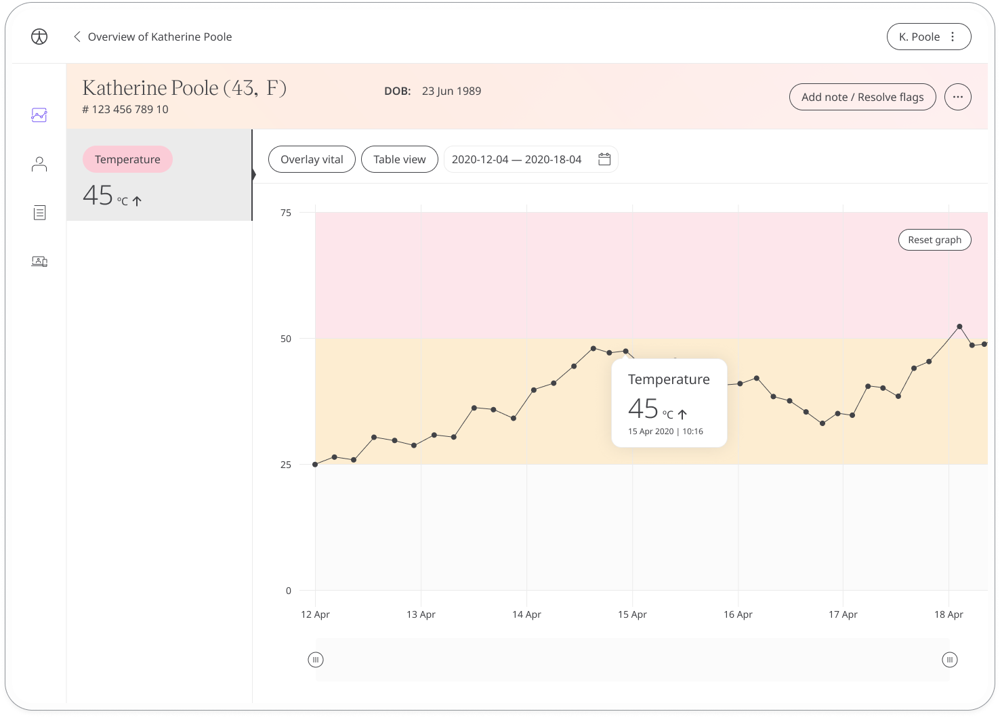

Body temperature is a vital sign used to monitor a patient and to ensure safe and effective health care.

## How it works

Patients measure their body temperature using a thermometer and enter their reading into the Huma App. 

The time and date is added automatically at the moment they make the entry (although this can be edited if needed) and patients will also be able to view all their historic results from within the module. Reminders can be set to help them stay on track and make sure they don't miss an entry.

In the Clinician Portal, care teams will be able to easily see the latest body temperature readings from their patients, with very low or very high flagged for attention.

The Patient Summary displays a more detailed view of the patient's historic readings in graph or table form.

